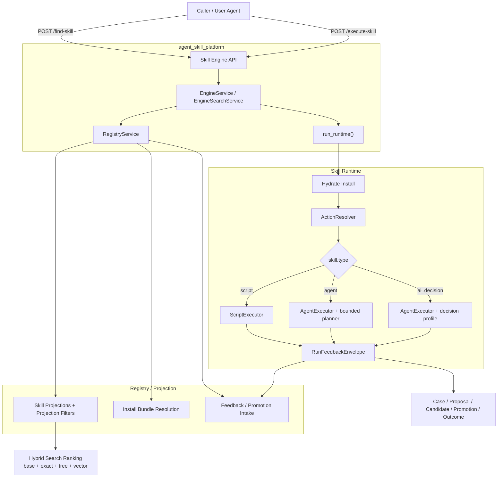

# Agent Skill Self-Evolution

`agent-skill-platform` 是一个面向自我迭代 Skill OS 的统一主仓。

它的目标不是只提供一个 runtime、一个 registry，或一组仓内脚本接口，而是把 skill 的定义、检索、执行、反馈、candidate 生成、lab 评测、promotion、publish 串成一条可持续演进的系统闭环。

当前仓已经吸收并整合了多个来源项目的方法、架构和核心源码，用来形成新的统一主仓，而不是一个简单的聚合壳或临时工作台。

## 当前代码状态

截至 2026-04-08，当前最贴近仓内实现的状态文档是：

- `docs/plan/v0.5e-implementation-status.md`

它记录的是当前仓已经落地并通过验证的实现，不是早期设计意图。若工程设计文档、来源对齐文档与代码有冲突，应优先以这份状态文档和 `tests/` 内的 smoke / regression 测试为准。

## v0.5 迭代结论

根据当前仓内源码、API 门面和测试结果，v0.5 计划内剩余项已经全部收口完成。

### 已完成并通过验证

- 在线主链路已经打通：
  - `find_skill -> execute_skill -> runtime -> feedback`
- `skill.type` 已经进入 install / resolve / execute / feedback 全链路
- `script / agent / ai_decision` 三类 skill 已经统一到一套 skill package 与 runtime contract
- `AgentSkillPlatform` 已经提供统一 facade：
  - package/runtime
  - factory/lab
  - registry/engine
- backend enhancement 已经完成基础对象与 promotion lineage 收口：
  - `CaseRecord`
  - `CandidateProposal`
  - `ProposalAdapter`
  - `PromotionSubmission.lineage`
  - `LabPromotionOrchestrator`
- `EngineSearchService` 已收口为 projection-backed hybrid ranking：
  - `base_score`
  - `exact_bonus`
  - `tree_score`
  - `vector_score`
- `AgentExecutor` 已收口为 bounded multi-step planner：
  - 单 action fast path
  - 多 action planner path
  - `agent=6`、`ai_decision=3`
  - 只保留 `read_file / run_action`
- backend enhancement 已完成 feedback -> case -> decision -> proposal/candidate -> promotion intake -> outcome 的可审计闭环
- 主收口测试当前通过：
  - `tests/test_engine_search.py`
  - `tests/test_runtime_dispatch.py`
  - `tests/test_backend_enhancement.py`
  - `tests/test_platform_smoke.py`

一句话说，v0.5 范围内的目标已经完成；后续如果继续推进，将属于 v1 / production hardening，而不是本轮未完成项。

## 当前项目架构

当前仓内实际运行架构如下：



当前这张图反映的是“已经跑通”的架构，而不是设计阶段的理想终态。

### 当前架构要点

- 搜索层以 registry projection 为唯一对外真源，在 projection 结果上做 hybrid ranking，不暴露 manager 原始结构。
- runtime 对 `script / agent / ai_decision` 统一走一套 install/resolve/dispatch contract；其中多 action skill 进入 bounded planner，单 action skill 继续走 fast path。
- backend enhancement 已经把 feedback、case、proposal、candidate、promotion submission、outcome 串成一条可审计闭环。
- source、`runtime/src/python` mirror、`integration/src/python` 三套实现已经通过同一组测试验收。

## 项目定义

这个仓的目标形态是一个自我迭代的 Skill OS。它要解决的不是“如何执行某个 skill”，而是下面这整条链路如何闭环：

- 定义 skill package
- 在 registry 中发布、治理、检索 skill
- 在 environment kernel 中选择并装配 skill
- 在 runtime 中执行 action 并产出 artifacts / feedback
- 基于反馈、failure、workflow 和 transcript 生成 candidate
- 在 skill lab 中评测 candidate
- 通过 promotion gate 决定是否进入下一轮发布与复用

这个系统目标来自根目录工程设计文档中的五层划分，而当前仓承担的是这套 Skill OS 的统一主仓角色。

## 来源整合

当前仓的系统能力主要吸收自四类来源：

### AgentSkillOS

已吸收整合的方向：

- environment kernel
- runtime
- manager / orchestrator 双轴结构
- mode selection
- run context / artifact / feedback 运行链路

当前仓中对应的源码面包括：

- `src/environment/`
- `src/manager/`
- `src/orchestrator/`
- `src/workflow/`

### skillhub

已吸收整合的方向：

- registry
- search
- governance
- publish / review / lifecycle / download 的系统边界

当前仓并没有完整回填 `skillhub` 的全部生产级能力，但 registry 的系统角色、安装合同、反馈回流和晋升提交边界都延续自这一来源。

### yao-meta-skill

已吸收整合的方向：

- skill package authoring contract
- validation / packaging 思路
- governance / evaluation contract
- `manifest.json` / `interface.yaml` 等元信息约束

当前仓中的 contract、validator、bundler 设计口径承接自这一来源。

### loomiai-autoresearch

已吸收整合的方向：

- skill lab
- research runtime
- project scaffold
- MCP / artifact lifecycle
- candidate 评测与提交链路

当前仓中的 `src/autoresearch_agent/` 已经把这些核心源码纳入主仓。

## 系统闭环

这个仓面向的完整闭环不是单点执行，而是下面这条自我迭代链路：

`Task / Transcript / Failure -> Environment Kernel -> Registry Search -> Runtime Hydration -> Action Execution -> Feedback -> Skill Factory -> Candidate -> Skill Lab -> Promotion Gate -> Registry Publish -> Reuse`

当前仓之所以要同时保留 contracts、kernel/runtime、lab、registry integration 实现，就是因为它服务的目标不是单个子系统，而是这条 Skill OS 闭环。

## 当前仓已落地内容

当前仓已经内聚到主仓中的实现主要包括：

### Contracts

- `src/skill_contract/`
- `src/agent_skill_platform/contracts/`

覆盖内容：

- `SKILL.md / manifest.json / actions.yaml / interface.yaml` 解析
- package validator
- source bundle / runtime install materialization

### Kernel / Runtime

- `src/environment/`
- `src/manager/`
- `src/orchestrator/`
- `src/workflow/`
- `src/agent_skill_platform/kernel/`
- `src/agent_skill_platform/runtime/`

覆盖内容：

- manager / engine registry
- install hydration
- action resolve
- runner 执行
- artifact 扫描
- feedback envelope 生成

### Skill Lab

- `src/autoresearch_agent/`
- `src/agent_skill_platform/lab/`

覆盖内容：

- lab project scaffold
- skill research runtime
- run artifact 生命周期
- promotion submission 构建

### Registry Integration Implementation

- `src/agent_skill_platform/registry/`
- `src/agent_skill_platform/engine/`

这里保留的是当前主仓内的 integration implementation，用于打通 install bundle、skill projection、find/execute、feedback、promotion submission 的主链路验证。

它是当前仓内已落地实现的一部分，但不应被理解成整个 Skill OS 在 registry/search/governance 维度上的最终生产形态定义。

### Upstream Snapshots

- `upstream_snapshot/`

这里保留的是迁移来源快照，用于对照吸收来源和后续继续回填能力。

## 一期冻结接口

当前仓沿用的一期冻结接口只有四条：

- `actions.yaml`
- `RuntimeInstallBundle`
- `RunFeedbackEnvelope`
- `PromotionSubmission`

这四条接口是一阶段集成收口口径，用于稳定 package、runtime、registry、lab 之间的主链路联调，不等于 Skill OS 的全部目标能力。

Skill OS 的完整目标仍然包含 candidate、lab、promotion、publish 之后的持续迭代闭环。

## 仓内 SDK / CLI

当前仓提供了一层统一的仓内 SDK / CLI，作用是把已经吸收进主仓的能力组织成便于开发、联调和 smoke 验证的入口。

这些接口是开发便利层，不是系统总设计的中心对象。

### Python API

- `agent_skill_platform.AgentSkillPlatform`
- `agent_skill_platform.contracts.validate_skill_package`
- `agent_skill_platform.runtime.build_runtime_install_bundle`
- `agent_skill_platform.runtime.hydrate_runtime_install`
- `agent_skill_platform.runtime.run_runtime`
- `agent_skill_platform.find_skill`
- `agent_skill_platform.execute_skill`
- `agent_skill_platform.build_candidate_payload`
- `agent_skill_platform.prepare_candidate_for_lab`
- `agent_skill_platform.run_factory_pipeline`
- `agent_skill_platform.lab.init_skill_lab_project`
- `agent_skill_platform.lab.run_skill_lab_project`
- `agent_skill_platform.lab.build_promotion_submission`
- `agent_skill_platform.registry.publish_package`
- `agent_skill_platform.registry.resolve_install_bundle`
- `agent_skill_platform.registry.ingest_feedback`
- `agent_skill_platform.registry.submit_promotion`

### CLI

- `asp validate-package`
- `asp build-install-bundle`
- `asp run-runtime`
- `asp init-skill-lab`
- `asp run-skill-lab`
- `asp build-promotion-submission`
- `asp registry serve`
- `asp registry publish`
- `asp registry install-bundle`
- `asp registry ingest-feedback`
- `asp registry submit-promotion`

## 当前已验证链路

当前仓已经验证的主链路包括：

- `publish -> install bundle -> hydrate -> execute action -> feedback`
- `find_skill -> execute_skill -> runtime -> feedback`
- `init skill lab -> run -> build promotion submission -> registry intake`
- `build_candidate_payload / prepare_candidate_for_lab / run_factory_pipeline -> generated package -> publish`

此外，`PromotionSubmission.lineage`、`registry promotion_requests.case_id / proposal_id / decision_mode / lineage_json`、`PlatformPaths.contracts_root / runtime_root / lab_root / factory_root / registry_root_dir` 这些兼容入口也已经在仓内 smoke 测试中固定下来。

这说明当前主仓已经具备一阶段主链路验证能力，但这不应被解读为整个 Skill OS 的目标已经收缩成最小闭环。

## 仓结构

```text
agent-skill-platform/
├── docs/
├── packages/
├── runtimes/
├── services/
├── src/
│   ├── agent_skill_platform/
│   ├── autoresearch_agent/
│   ├── environment/
│   ├── manager/
│   ├── orchestrator/
│   ├── skill_contract/
│   └── workflow/
├── tests/
├── upstream_snapshot/
└── pyproject.toml
```

说明：

- `src/agent_skill_platform/` 是仓内统一入口
- `src/skill_contract/`、`src/orchestrator/`、`src/autoresearch_agent/` 等是已经吸收进入主仓的核心源码
- `upstream_snapshot/` 是来源快照，不参与当前主运行路径

## 本地部署与联调

下面的流程对应当前仓内已经通过测试验证的部署/联调方式。

### 安装

```bash
cd agent-skill-platform
python3 -m venv .venv
source .venv/bin/activate
pip install -e .
```

如需更完整的 kernel / lab 依赖：

```bash
pip install -e '.[kernel]'
```

### 验证当前收敛状态

```bash
~/.pyenv/versions/3.11.8/bin/python -m pytest tests/test_engine_search.py tests/test_runtime_dispatch.py tests/test_backend_enhancement.py tests/test_platform_smoke.py
```

### 查看仓内路径

```bash
asp paths
```

### 1. 校验一个 skill package

```bash
asp validate-package tests/fixtures/github-pr-review
```

### 2. 构建 install bundle

```bash
asp build-install-bundle tests/fixtures/github-pr-review
```

### 3. 直接执行 runtime

```bash
asp run-runtime tests/fixtures/github-pr-review --action-input '{"task":"review-pr"}'
```

### 4. 启动本地 registry + engine 一体化服务

当前 `asp registry serve` 会启动仓内 FastAPI 应用，并同时挂出：

- `GET /healthz`
- `GET /skills`
- `GET /skills/projections`
- `GET /skills/{skill_id}`
- `GET /skills/{skill_id}/projection`
- `GET /skills/{skill_id}/install-bundle`
- `POST /publish`
- `POST /feedback`
- `POST /promotions`
- `POST /find-skill`
- `POST /execute-skill`

```bash
asp registry serve --root .data/registry --host 127.0.0.1 --port 8000
```

### 5. 发布一个 skill 到本地 registry

```bash
asp registry publish tests/fixtures/github-pr-review --root .data/registry
```

### 6. 解析 install bundle

```bash
asp registry install-bundle github-pr-review --root .data/registry
```

### 7. 通过 HTTP 调用 `find_skill`

```bash
curl -X POST http://127.0.0.1:8000/find-skill \
  -H 'content-type: application/json' \
  -d '{
    "query": "GitHub pull request review",
    "limit": 5,
    "filters": {}
  }'
```

### 8. 通过 HTTP 调用 `execute_skill`

```bash
curl -X POST http://127.0.0.1:8000/execute-skill \
  -H 'content-type: application/json' \
  -d '{
    "skill_id": "github-pr-review",
    "parameters": {
      "task": "review-pr"
    }
  }'
```

### 9. 初始化并运行 skill lab

```bash
asp init-skill-lab /tmp/asp-skill-lab --project-name Demo --overwrite
asp run-skill-lab /tmp/asp-skill-lab
asp build-promotion-submission /tmp/asp-skill-lab <run_id>
```

### 10. 运行 factory facade

CLI 当前主要覆盖 contracts / runtime / lab / registry 基础入口；`build_candidate_payload`、`prepare_candidate_for_lab`、`run_factory_pipeline` 更适合通过 Python API 调用：

```python
from agent_skill_platform import AgentSkillPlatform

platform = AgentSkillPlatform()
payload = platform.run_factory_pipeline(
    "/tmp/asp-factory-demo",
    skill_name="Demo Candidate",
    workflow={
        "description": "Package a repeatable workflow into a governed skill.",
        "inputs": ["task brief"],
        "outputs": ["generated package", "gate summary"],
    },
    failure={"summary": "A repeated task should become a reusable skill."},
    overwrite=True,
)

print(payload["generated_dir"])
print(payload["bundle_path"])
```

### 11. 当前部署口径说明

- 当前更准确的说法是“本地集成部署 / 联调部署”，不是生产级分布式部署
- `registry serve` 启动的是仓内一体化 FastAPI 服务，适合开发、验证和 smoke
- 当前仓已经支持 v0.5 所需的本地集成联调链路：
  - publish package
  - resolve projection / install bundle
  - `find_skill / execute_skill`
  - feedback ingest
  - lab candidate / promotion submission
- 若要继续进入生产化部署，后续重点会转向：
  - 搜索基础设施扩展与可观测性
  - planner 依赖治理与稳定性
  - promotion review / approval 的产品化界面

## 文档索引

设计文档位于：

- `docs/plan/v0.5e-implementation-status.md`
- `docs/engineering/README.md`
- `docs/engineering/00-program-overview-and-reuse-map.md`
- `docs/engineering/01-environment-kernel-and-runtime.md`
- `docs/engineering/02-skill-package-and-actions.md`
- `docs/engineering/03-registry-search-governance.md`
- `docs/engineering/04-skill-factory-and-lab.md`
- `docs/engineering/05-implementation-roadmap.md`
- `docs/engineering/06-integration-freeze-and-delivery-plan.md`
- `docs/engineering/08-repo-positioning-and-readme-correction-plan.md`

其中：

- `v0.5e` 记录当前仓已经通过测试验证的实现状态，优先级最高
- `00` 说明系统总目标与来源复用映射
- `06` 说明一阶段冻结接口与收口范围
- `08` 说明当前仓的正式定位与 README 修正口径
