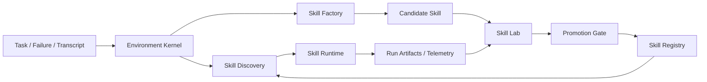

    # Agent 环境工程与 SkillOS 工程化落地设计

日期：2026-04-02  
作者：Codex（基于本地仓库代码研读）  
适用范围：任务1「环境工程 + 自我研究 + 自生成 skill」与任务2「AgentSkillOS / skillhub 递进式工程落地」

## 0. 结论先行

核心判断只有一句话：

`harness` 的终局不是“持续堆脚手架”，而是“把脚手架降级为环境装配器”，让 agent 在不同环境层中按需发现、生成、装配、验证、晋升 skill。

原因也只有一句话：

edge case 是开放集合，固定脚手架只能覆盖已知问题；只有把 `skill`、`runtime`、`registry`、`evaluation`、`governance` 做成一个可演化环境，agent 才能用更低成本持续吸收新边界条件。

因此，未来工程不应该再把重点放在：

- 单一 mega harness
- 不断堆系统提示词
- 把所有行为硬编码在 orchestrator 里

而应该放在：

- `Environment Kernel`：环境感知、环境约束、环境装配
- `Skill Factory`：从 workflow / transcript / failure 生成 candidate skill
- `Skill Lab`：在受控实验环境里迭代、评测、回归、打分
- `Skill Runtime`：在任务执行时按环境动态挂载、调度、执行 skill
- `Skill Registry`：版本、分发、搜索、治理、审核、回滚

一句更工程化的话：

未来不是 `Harness Engineering`，而是 `Environment-Native Agent Engineering`。

## 1. 本文依据的代码证据

本文不是抽象讨论，而是基于当前工作区内四个仓库的真实结构做出的结论。

### 1.1 `yao-meta-skill`

这个仓库提供了“元 skill 如何被生产、评测、打包、治理”的完整原型。

关键证据：

- [yao-meta-skill/README.md](/Users/chenge/Desktop/skills-gp-%20research/yao-meta-skill/README.md)
- [yao-meta-skill/manifest.json](/Users/chenge/Desktop/skills-gp-%20research/yao-meta-skill/manifest.json)
- [yao-meta-skill/agents/interface.yaml](/Users/chenge/Desktop/skills-gp-%20research/yao-meta-skill/agents/interface.yaml)
- [yao-meta-skill/scripts/cross_packager.py](/Users/chenge/Desktop/skills-gp-%20research/yao-meta-skill/scripts/cross_packager.py)
- [yao-meta-skill/scripts/governance_check.py](/Users/chenge/Desktop/skills-gp-%20research/yao-meta-skill/scripts/governance_check.py)

它已经把 skill 视为：

- 有触发面
- 有中立元数据
- 有适配层
- 有治理成熟度
- 有评测与晋升机制

这对任务1非常关键，因为它证明了“meta skill”不是一句 prompt，而是一个可验证的 skill factory 原型。

### 1.2 `loomiai-autoresearch`

这个仓库提供了“受控研究 runtime + pack/project 脚手架 + MCP 暴露面”的原型。

关键证据：

- [loomiai-autoresearch/README.md](/Users/chenge/Desktop/skills-gp-%20research/loomiai-autoresearch/README.md)
- [loomiai-autoresearch/docs/runtime-architecture.md](/Users/chenge/Desktop/skills-gp-%20research/loomiai-autoresearch/docs/runtime-architecture.md)
- [loomiai-autoresearch/src/autoresearch_agent/core/packs/schema.py](/Users/chenge/Desktop/skills-gp-%20research/loomiai-autoresearch/src/autoresearch_agent/core/packs/schema.py)
- [loomiai-autoresearch/src/autoresearch_agent/core/packs/project.py](/Users/chenge/Desktop/skills-gp-%20research/loomiai-autoresearch/src/autoresearch_agent/core/packs/project.py)
- [loomiai-autoresearch/src/autoresearch_agent/core/runtime/manager.py](/Users/chenge/Desktop/skills-gp-%20research/loomiai-autoresearch/src/autoresearch_agent/core/runtime/manager.py)

它已经把研究问题收敛成：

- `pack manifest`
- `research.yaml`
- `editable_targets`
- `run artifacts`
- `MCP lifecycle`

这对任务1也非常关键，因为它证明了“自我研究”要成立，必须先把可变面、运行面、产物面、状态面做成受控 runtime，而不是直接把 agent 扔进无限制环境。

### 1.3 `AgentSkillOS`

这个仓库提供了“运行时编排、技能发现、分层检索、隔离执行”的原型。

关键证据：

- [AgentSkillOS/ARCHITECTURE.md](/Users/chenge/Desktop/skills-gp-%20research/AgentSkillOS/ARCHITECTURE.md)
- [AgentSkillOS/src/orchestrator/runtime/run_context.py](/Users/chenge/Desktop/skills-gp-%20research/AgentSkillOS/src/orchestrator/runtime/run_context.py)
- [AgentSkillOS/src/orchestrator/dag/skill_registry.py](/Users/chenge/Desktop/skills-gp-%20research/AgentSkillOS/src/orchestrator/dag/skill_registry.py)
- [AgentSkillOS/src/orchestrator/dag/engine.py](/Users/chenge/Desktop/skills-gp-%20research/AgentSkillOS/src/orchestrator/dag/engine.py)
- [AgentSkillOS/src/orchestrator/freestyle/engine.py](/Users/chenge/Desktop/skills-gp-%20research/AgentSkillOS/src/orchestrator/freestyle/engine.py)
- [AgentSkillOS/src/workflow/service.py](/Users/chenge/Desktop/skills-gp-%20research/AgentSkillOS/src/workflow/service.py)
- [AgentSkillOS/src/manager/tree/layered_searcher.py](/Users/chenge/Desktop/skills-gp-%20research/AgentSkillOS/src/manager/tree/layered_searcher.py)
- [AgentSkillOS/src/manager/tree/layer_processor.py](/Users/chenge/Desktop/skills-gp-%20research/AgentSkillOS/src/manager/tree/layer_processor.py)

它证明了两件事：

- skill runtime 必须是隔离环境，而不是直接在主仓库原地执行
- skill discovery 在技能规模变大后必须分层，否则在线检索成本会爆炸

### 1.4 `skillhub`

这个仓库提供了“工业级 skill registry / lifecycle / publish / scan / search / label”的原型。

关键证据：

- [skillhub/docs/01-system-architecture.md](/Users/chenge/Desktop/skills-gp-%20research/skillhub/docs/01-system-architecture.md)
- [skillhub/docs/07-skill-protocol.md](/Users/chenge/Desktop/skills-gp-%20research/skillhub/docs/07-skill-protocol.md)
- [skillhub/docs/14-skill-lifecycle.md](/Users/chenge/Desktop/skills-gp-%20research/skillhub/docs/14-skill-lifecycle.md)
- [skillhub/docs/2026-04-01-skill-discovery-and-recommendation-architecture.md](/Users/chenge/Desktop/skills-gp-%20research/skillhub/docs/2026-04-01-skill-discovery-and-recommendation-architecture.md)
- [skillhub/server/skillhub-domain/src/main/java/com/iflytek/skillhub/domain/skill/Skill.java](/Users/chenge/Desktop/skills-gp-%20research/skillhub/server/skillhub-domain/src/main/java/com/iflytek/skillhub/domain/skill/Skill.java)
- [skillhub/server/skillhub-domain/src/main/java/com/iflytek/skillhub/domain/skill/SkillVersion.java](/Users/chenge/Desktop/skills-gp-%20research/skillhub/server/skillhub-domain/src/main/java/com/iflytek/skillhub/domain/skill/SkillVersion.java)
- [skillhub/server/skillhub-domain/src/main/java/com/iflytek/skillhub/domain/skill/SkillFile.java](/Users/chenge/Desktop/skills-gp-%20research/skillhub/server/skillhub-domain/src/main/java/com/iflytek/skillhub/domain/skill/SkillFile.java)
- [skillhub/server/skillhub-domain/src/main/java/com/iflytek/skillhub/domain/skill/service/SkillPublishService.java](/Users/chenge/Desktop/skills-gp-%20research/skillhub/server/skillhub-domain/src/main/java/com/iflytek/skillhub/domain/skill/service/SkillPublishService.java)
- [skillhub/server/skillhub-domain/src/main/java/com/iflytek/skillhub/domain/skill/metadata/SkillMetadataParser.java](/Users/chenge/Desktop/skills-gp-%20research/skillhub/server/skillhub-domain/src/main/java/com/iflytek/skillhub/domain/skill/metadata/SkillMetadataParser.java)
- [skillhub/server/skillhub-domain/src/main/java/com/iflytek/skillhub/domain/skill/validation/SkillPackageValidator.java](/Users/chenge/Desktop/skills-gp-%20research/skillhub/server/skillhub-domain/src/main/java/com/iflytek/skillhub/domain/skill/validation/SkillPackageValidator.java)
- [skillhub/server/skillhub-domain/src/main/java/com/iflytek/skillhub/domain/security/SecurityScanService.java](/Users/chenge/Desktop/skills-gp-%20research/skillhub/server/skillhub-domain/src/main/java/com/iflytek/skillhub/domain/security/SecurityScanService.java)
- [skillhub/server/skillhub-infra/src/main/java/com/iflytek/skillhub/infra/scanner/SkillScannerAdapter.java](/Users/chenge/Desktop/skills-gp-%20research/skillhub/server/skillhub-infra/src/main/java/com/iflytek/skillhub/infra/scanner/SkillScannerAdapter.java)

它证明了：

- skill 一旦进入团队或平台使用，就必须进入 versioned / governed / searchable / scan-able 的工业生命周期

## 2. 任务1：为什么说 harness 工程的后面必然是环境工程

### 2.1 你当前判断是对的

你提到的核心矛盾是：

- `Claude Code`、`Codex` 之类系统本质上是脚手架综合体
- 但 edge case 是开放集合，甚至是熵增集合
- 因此不断给 harness 打补丁，本质上是用有限手工规则追无限环境变化

这件事从工程上看会出现四个不可避免的问题：

1. 脚手架集中度越来越高，系统会变成难维护的“超级 if-else”
2. 行为规则散落在 prompt、tool wrapper、runtime hook、fallback 里，难以版本化
3. 新 edge case 的修复难以沉淀成可复用能力，常常只修当前路径
4. 系统越来越像“一个固定 agent”，而不是“一个能在不同环境里组装能力的 agent 平台”

因此，正确方向不是继续把 harness 做厚，而是把 harness 退化成三件事：

- 感知当前环境
- 从环境推导需要的能力
- 把能力装配成一次可控执行

也就是：`harness -> environment assembler`

### 2.2 环境工程的正确定义

这里的环境，不是单指 docker / venv / OS，而是五层组合环境：

1. `Capability Environment`
   - 当前系统具备哪些 skill、tool、MCP、script、reference、adapter
2. `Execution Environment`
   - 当前任务在哪个工作区、什么权限、什么工具、什么模型、什么超时、什么网络边界下执行
3. `Context Environment`
   - 当前上下文能加载多少信息、优先加载哪些信息、如何做 progressive disclosure
4. `Governance Environment`
   - 当前环境允许哪些 skill 被自动执行，哪些必须审核，哪些只能只读
5. `Evolution Environment`
   - 当前任务失败、回归、重复出现后，系统如何生成新 skill、验证 skill、晋升 skill

也就是说：

今天多数 harness 只在做第 2 层，少部分做到第 1 层；但真正决定 agent 长期上限的是第 4 层和第 5 层。

### 2.3 从四个仓库抽象出的统一架构

四个仓库其实分别对应未来系统的一块：

- `yao-meta-skill` 对应 `Skill Factory`
- `loomiai-autoresearch` 对应 `Skill Lab`
- `AgentSkillOS` 对应 `Skill Runtime`
- `skillhub` 对应 `Skill Registry`

所以真正的总架构应当是：



这个结构里，真正“长期有效”的不是中心大脑，而是闭环：

- 任务进来
- 环境判断
- skill 被装配和执行
- 结果被记录
- 失败或重复任务触发 candidate skill 生成
- candidate 进入 lab 验证
- 通过后发布进 registry
- 下次再被 runtime 调度

这才是自我研究、自我生成 skill 的工程闭环。

### 2.4 任务1的最终结论

最终结论可以明确写成下面三句：

1. `Harness` 不应该继续做成“所有 edge case 的中心解释器”，而应该做成“环境感知与环境装配内核”。
2. `Skill` 不应该只是 prompt 文本，而应该是一个带触发、动作、评测、治理、适配、生命周期的能力单元。
3. `Self-research` 不应该直接运行在线上任务链路里，而应该进入受控的 `Skill Lab`，用实验、回归、晋升把 candidate 转成 production skill。

换句话说：

未来 agent 的演进主战场不是 `prompt engineering`，也不是 `harness engineering`，而是 `environment engineering + capability evolution engineering`。

## 3. 任务1的具体工程落地方案

### 3.1 先定义五个系统

#### A. Environment Kernel

职责：

- 识别任务环境
- 解析运行约束
- 选择运行模式
- 决定是否走已有 skill、无 skill、候选 skill、研究路径

输入：

- task
- workspace
- user profile
- available tools
- installed skills
- registry metadata

输出：

- `ExecutionPlan`
- `SkillSelection`
- `EnvironmentProfile`

建议落地：

- 借用 `AgentSkillOS` 的 manager + engine registry 思路
- 但把“skill discovery”和“engine choice”收敛到统一环境判定器中

#### B. Skill Factory

职责：

- 把 transcript / workflow note / recurring failure 转成 candidate skill

输入来源：

- 手工沉淀的 SOP
- agent 运行日志
- 高频重复任务
- 失败 case
- 多轮修复历史

建议直接复用的思路：

- `yao-meta-skill` 的 `SKILL.md + interface.yaml + manifest.json + evals + governance` 结构

#### C. Skill Lab

职责：

- 对 candidate skill 做受控验证、回归、打分、变异和晋升

建议直接复用的思路：

- `loomiai-autoresearch` 的 `research.yaml + editable_targets + run artifacts + MCP lifecycle`

但需要改造：

- editable target 不再只有 `workspace/strategy.py`
- 改成可对 `SKILL.md`、`actions.yaml`、`scripts/*`、`evals/*` 做受控实验

#### D. Skill Runtime

职责：

- 任务时装配 skill
- 按运行模式执行
- 保存 artifacts
- 反馈 telemetry

建议直接复用的思路：

- `AgentSkillOS` 的 `RunContext`
- `dag / free-style / no-skill` 多执行引擎
- active / dormant 分层检索

#### E. Skill Registry

职责：

- 存储 skill、version、bundle、search doc、labels、scan result、governance state

建议直接复用的思路：

- `skillhub` 的 `Skill / SkillVersion / SkillFile`
- publish / review / scan / label / lifecycle / search document

### 3.2 推荐的主数据流

建议主链路拆成三条：

#### 运行链路

`task -> environment judge -> skill retrieval -> run context hydration -> skill action execution -> artifacts + telemetry`

#### 演化链路

`failure / recurrence / manual intent -> meta skill generate candidate -> skill lab eval -> promotion gate -> registry publish`

#### 治理链路

`publish -> scan -> review -> labels / score / search index -> runtime eligible`

### 3.3 第一个可落地版本该怎么做

不要一上来做“全自动自进化”，应分四期。

#### Phase 0：兼容基线

目标：

- 统一 skill 物理结构
- 统一安装目录与 registry bundle
- 统一 metadata contract

最低要求：

- 保持 `SKILL.md` 兼容
- 增加 `manifest.json`
- 增加 `agents/interface.yaml`
- 增加显式 action 声明

#### Phase 1：运行时闭环

目标：

- 让 skill 变成可调度、可执行、可记录的运行单元

最低要求：

- runtime 能发现 skill
- 能根据 action contract 调脚本
- 能写 run artifacts
- 能把 telemetry 反馈给 registry

#### Phase 2：候选 skill 实验闭环

目标：

- 让 meta skill 产出的 candidate 不直接进入生产，而是先进入 lab

最低要求：

- candidate workspace
- eval suite
- regression gate
- promotion rule

#### Phase 3：自动化晋升

目标：

- 高频成功 candidate 可以半自动晋升为生产 skill

最低要求：

- governance score
- security scan
- compatibility packaging
- canary / staged rollout

## 4. 任务2：Skill 应该怎样单元化

### 4.1 逻辑单元与物理单元要分开

这是最关键的一点。

`skill` 的单元化不能只看文件夹，还要看运行语义。

建议分三层：

#### 1. 逻辑单元：`SkillUnit`

一个 `SkillUnit` 是一个可被检索、可被安装、可被调度、可被评测、可被治理的最小能力包。

它至少包含六个逻辑面：

- `TriggerUnit`
- `InstructionUnit`
- `ActionUnit`
- `EvalUnit`
- `GovernanceUnit`
- `AdapterUnit`

#### 2. 物理单元：`SkillPackage`

即一个目录 / zip bundle / object storage bundle。

#### 3. 运行单元：`SkillInstall`

即某次运行中实际被挂载到环境里的那份 skill 副本。

这三层不能混：

- registry 存的是 `SkillPackage`
- runtime 执行的是 `SkillInstall`
- recommendation / retrieval 依赖的是 `SkillUnit metadata`

这里应明确继承 `AgentSkillOS` 的一个重要纪律：

- 检索阶段只扫描轻量 metadata
- 执行阶段再把完整 skill 目录复制进隔离环境

不要让 registry 查询、workspace 原目录、执行目录三者混成一个对象。

### 4.2 建议的 skill 目录结构

建议采用“外部兼容 + 内部工业增强”双层结构。

```text
my-skill/
├── SKILL.md                  # 必需。OpenSkills / Claude / skillhub 兼容入口
├── manifest.json             # 必需。治理、版本、平台、成熟度
├── actions.yaml              # 必需。显式声明可执行 action
├── agents/
│   └── interface.yaml        # 必需。中立兼容元数据
├── references/               # 可选。长文档、规则、背景知识
├── scripts/                  # 可选。被 actions.yaml 引用的脚本
├── evals/                    # 强烈建议。cases、goldens、gates
├── tests/                    # 强烈建议。结构校验、回归校验
├── adapters/                 # 可选。平台特定导出文件
├── reports/                  # 可选。评测历史、打分、晋升记录
└── assets/                   # 可选。静态资源
```

这个设计直接吸收了：

- `skillhub` 的 `SKILL.md` 兼容协议
- `yao-meta-skill` 的 `manifest.json + interface.yaml + evals + reports`
- `AgentSkillOS` 对 `SKILL.md` 目录的运行时发现方式

这里还要强调一个工程纪律：

- skill 的最小分发单元必须是“目录包”，不是单文件
- `SKILL.md` 只是入口，不是 skill 的全部
- `scripts/`、`references/`、`assets/`、`evals/` 必须和入口一起版本化

### 4.3 `SKILL.md` 负责什么

`SKILL.md` 只负责四件事：

- 触发条件
- 使用边界
- 高层工作流
- 输出契约

它不应该承担：

- 全部脚本参数定义
- 全部环境依赖定义
- 全部评测定义
- 平台适配细节

也就是说，`SKILL.md` 应保持“轻入口”，这点与 `yao-meta-skill` 的方法一致。

### 4.4 `manifest.json` 负责什么

建议把 `manifest.json` 定义成工业治理主文件。

建议字段：

```json
{
  "name": "github-pr-review",
  "version": "1.2.0",
  "owner": "platform-agent-team",
  "updated_at": "2026-04-02",
  "status": "active",
  "maturity_tier": "production",
  "lifecycle_stage": "library",
  "review_cadence": "quarterly",
  "target_platforms": ["openai", "claude", "generic"],
  "factory_components": ["references", "scripts", "evals", "reports"],
  "risk_level": "medium",
  "default_runtime_profile": "python311-safe",
  "default_action": "run",
  "registry_labels": ["code-review", "github", "safe-local"],
  "compatibility": {
    "canonical_format": "agent-skills",
    "requires_actions_yaml": true
  }
}
```

为什么要保留它：

- `skillhub` 当前已经有 `parsedMetadataJson` 和 `manifestJson` 的版本级存储位
- `yao-meta-skill` 已经证明 manifest 适合承载治理语义
- 未来 skill 的 lifecycle、promotion、rollout 不能只靠 frontmatter

### 4.5 `actions.yaml` 负责什么

这是任务2里最关键的新增文件。

原因：

- 不能让 runtime 靠扫描 `scripts/` 猜哪个脚本该执行
- 不能把脚本调用逻辑埋进 prompt
- 不能让 agent 任意执行 skill 包里的任意文件

必须显式声明 action contract。

建议结构：

```yaml
schema_version: actions.v1
actions:
  - id: run
    kind: script
    entry: scripts/run.py
    runtime: python3
    timeout_sec: 120
    sandbox: workspace-write
    input_schema:
      type: object
      properties:
        task:
          type: string
        workspace:
          type: string
      required: [task]
    output_schema:
      type: object
      properties:
        summary:
          type: string
        artifacts:
          type: array
    side_effects:
      - writes_workspace
      - writes_report
    idempotency: best_effort
    telemetry:
      emit: [latency_ms, exit_code, artifact_count]

  - id: validate
    kind: script
    entry: scripts/validate.py
    runtime: python3
    timeout_sec: 30
    sandbox: read-only
    side_effects: []
```

这个文件让三件事首次明确：

1. 哪些脚本可被执行
2. 在什么环境下执行
3. 预期输入输出是什么

### 4.6 逻辑上的六个子单元

建议一个 skill 在 registry 内部被拆成六种子单元记录。

#### `TriggerUnit`

存储：

- description
- anti-trigger
- route examples
- confidence threshold

来源：

- `SKILL.md` frontmatter + evals

#### `InstructionUnit`

存储：

- `SKILL.md` 正文
- references 索引
- progressive disclosure 索引

#### `ActionUnit`

存储：

- `actions.yaml`
- `scripts/*`
- runtime profile

#### `EvalUnit`

存储：

- eval cases
- holdout cases
- regression suite
- blind judge config

#### `GovernanceUnit`

存储：

- owner
- maturity tier
- review cadence
- security verdict
- promotion decision

#### `AdapterUnit`

存储：

- interface.yaml
- openai / claude / generic packaging outputs

## 5. 单元化后应该怎么存储

### 5.1 物理存储要分四层

#### A. Git Source Store

用途：

- 人类可读、可 review 的源 skill

存放内容：

- 全量 skill package 目录

建议位置：

- monorepo 内部 skill 目录
- 或独立 git 仓库

#### B. Registry Metadata Store

用途：

- 检索、治理、版本、生命周期

建议直接沿用并扩展 `skillhub` 当前表：

- `skill`
- `skill_version`
- `skill_file`

新增建议：

- `skill_action`
- `skill_eval_suite`
- `skill_environment_profile`
- `skill_dependency`
- `skill_score_snapshot`
- `skill_run_feedback`
- `skill_candidate`
- `skill_promotion_decision`

并强烈建议沿用 `skillhub` 已经验证过的三条纪律：

- `Skill`、`SkillVersion`、`SkillFile` 分开建模
- 分发 tag 和分类 label 分开建模
- 搜索文档与主业务表分开建模

#### C. Object Storage

用途：

- bundle zip
- file blobs
- compiled adapters
- reports
- run artifacts

key 规则可直接沿用 `skillhub`：

- `skills/{skillId}/{versionId}/{filePath}`
- `packages/{skillId}/{versionId}/bundle.zip`

并新增：

- `runs/{runId}/artifact/*`
- `compiled/{skillId}/{versionId}/{target}/*`

#### D. Runtime Install Cache

用途：

- 某个 workspace / 某次执行真正挂载的 skill 副本

建议兼容路径：

- `./.agent/skills/<slug>/`
- `~/.agent/skills/<slug>/`
- `./.claude/skills/<slug>/`
- `~/.claude/skills/<slug>/`

并在执行时复制到隔离 run dir：

- `RunContext.exec_dir/.claude/skills/<slug>/`

这点基本可直接借用 `AgentSkillOS` 的隔离思路。

### 5.2 数据模型建议

建议在 `skillhub` 现有模型之上增加下面几类表。

#### `skill_action`

字段建议：

- `id`
- `version_id`
- `action_id`
- `kind`
- `entry_path`
- `runtime`
- `timeout_sec`
- `sandbox_mode`
- `input_schema_json`
- `output_schema_json`
- `side_effects_json`

#### `skill_environment_profile`

字段建议：

- `id`
- `version_id`
- `profile_name`
- `os_family`
- `python_version`
- `node_version`
- `allow_network`
- `required_tools_json`
- `required_env_refs_json`

#### `skill_eval_suite`

字段建议：

- `id`
- `version_id`
- `suite_name`
- `suite_type`
- `cases_blob_key`
- `pass_threshold`
- `latest_score`

#### `skill_run_feedback`

字段建议：

- `id`
- `version_id`
- `run_id`
- `task_hash`
- `environment_hash`
- `success`
- `latency_ms`
- `token_usage`
- `artifacts_json`
- `error_code`

#### `skill_candidate`

字段建议：

- `id`
- `source_type`
- `source_ref`
- `candidate_blob_key`
- `status`
- `derived_from_skill_id`
- `generated_by`

#### `skill_search_projection`

这个对象不一定要新建表名，但语义上必须存在。

建议字段：

- `skill_id`
- `published_version_id`
- `display_name`
- `summary`
- `body_text`
- `keywords`
- `category_labels`
- `runtime_tags`
- `tool_tags`
- `governance_flags`
- `score_snapshot`

注意：

- 这个 projection 只代表“latest published version”
- 公开搜索、默认下载、推荐都只依赖它
- 不允许直接从主表临时拼接分页搜索结果

## 6. skill 应该怎么被调度出来

### 6.1 调度不是“找到 skill 就执行”

应拆成五步：

1. `Retrieve`
   - 根据任务和环境找候选 skill
2. `Rank`
   - 根据治理、成功率、环境适配度排序
3. `Select Execution Mode`
   - no-skill / direct / free-style / dag / research
4. `Hydrate Environment`
   - 把 skill、files、env、workspace 装进隔离 run context
5. `Resolve Action`
   - 根据 action contract 执行，不做隐式脚本发现

在系统边界上，建议强制分成两层：

- `skillhub` 一类系统负责发布、审核、治理、检索、分发
- `AgentSkillOS` 一类系统负责环境装配、执行模式选择、run context、调度

也就是：

- registry 不是 runtime
- runtime 也不直接承担 registry 的治理责任

### 6.2 推荐的调度栈

#### 第 1 层：检索

建议组合三种检索：

- 结构化过滤：labels / runtime tags / risk level / visibility
- 文本检索：`skill_latest_doc`
- 分层检索：active / dormant

这里可以直接继承：

- `skillhub` 的 `skill_latest_doc + labels + ACL-aware search`
- `AgentSkillOS` 的 active / dormant 分层

建议明确保留两个检索轴：

- `manager axis`
  - 负责“找哪些 skill”
- `orchestrator axis`
  - 负责“如何运行这次任务”

这正是 `AgentSkillOS` 最值得保留的结构性设计。

#### 第 2 层：排序

排序不要一开始就做 RL 或 bandit。

建议固定公式：

`final_score = trigger_match * governance_weight * runtime_fit * success_rate * freshness`

其中：

- `trigger_match`
- `runtime_fit`
- `success_rate`
- `governance_weight`

都要落库可解释。

#### 第 3 层：模式选择

推荐模式：

- `no-skill`
  - 没有合适 skill，直接让基础 agent 处理
- `direct`
  - 只有一个强匹配 skill，直接执行默认 action
- `free-style`
  - skill 作为上下文存在，让 agent 自由决定调用
- `dag`
  - 多个 skill 需要明确依赖顺序
- `research`
  - 发现现有 skill 都不稳定，进入候选生成或实验链路

#### 第 4 层：环境装配

建议产出统一对象：

```json
{
  "runId": "run-20260402-001",
  "mode": "dag",
  "selectedSkills": ["github-pr-review", "ci-log-triage"],
  "actions": [
    {"skill": "github-pr-review", "action": "run"},
    {"skill": "ci-log-triage", "action": "analyze"}
  ],
  "environmentProfile": "python311-safe",
  "workspaceRoot": "/tmp/aso-xxxx/workspace",
  "artifactRoot": "/runs/run-20260402-001"
}
```

#### 第 5 层：action resolve

规则必须非常硬：

- 只有 `actions.yaml` 中声明的 action 可执行
- 脚本路径必须在 skill 根目录内
- runner 必须匹配 runtime profile
- 任何越权 action 直接拒绝

### 6.3 一个推荐的调度伪代码

```python
def dispatch(task, env):
    profile = environment_kernel.classify(task, env)
    candidates = registry.retrieve(task, profile)
    ranked = ranker.sort(candidates, task, profile)

    if not ranked:
        return run_no_skill(task, profile)

    mode = mode_selector.choose(ranked, profile)
    selected = selector.pick(ranked, mode)

    install = runtime.hydrate(
        mode=mode,
        skills=selected,
        workspace=env.workspace,
        profile=profile,
    )

    plan = planner.build(mode, selected, task)

    for step in plan.steps:
        action = registry.resolve_action(step.skill, step.action_id)
        runner.execute(action, install)

    runtime.persist_artifacts()
    telemetry.emit()
```

## 7. scripts 应该如何存放以及如何被调度执行

### 7.1 `scripts/` 的原则

`scripts/` 只能是 action 的实现载体，不能自己变成调度入口。

也就是：

- `scripts/` 是实现层
- `actions.yaml` 是调度层

任何直接扫描 `scripts/` 自动执行的做法，都会把 skill runtime 拖回不可治理状态。

### 7.2 建议的脚本分类

建议把 `scripts/` 分四类。

#### 1. `run-*`

主执行动作。

例如：

- `scripts/run.py`
- `scripts/run.sh`

#### 2. `validate-*`

结构和前置条件校验。

例如：

- `scripts/validate.py`
- `scripts/lint.py`

#### 3. `build-*`

编译、打包、导出。

例如：

- `scripts/package.py`
- `scripts/export_openai.py`

#### 4. `eval-*`

离线评测辅助脚本。

例如：

- `scripts/run_eval.py`
- `scripts/regression_check.py`

### 7.3 调度执行时的 runner 设计

建议 runtime 只实现少数几种 runner：

- `InstructionRunner`
  - 只加载 `SKILL.md` 和 references，不直接执行脚本
- `ScriptRunner`
  - 执行本地脚本
- `McpRunner`
  - skill action 实际上调用一个 MCP 工具
- `SubagentRunner`
  - skill action 实际上生成一个子代理执行计划

这样 action 的 kind 可以是：

```yaml
kind: instruction | script | mcp | subagent
```

### 7.4 脚本执行的硬约束

每个 script action 至少要带：

- `runtime`
- `timeout_sec`
- `sandbox`
- `allow_network`
- `expected_outputs`
- `required_env_refs`

这点可以直接借鉴 `loomiai-autoresearch` 的 `runtime / constraints / env_refs` 设计。

### 7.5 脚本执行后的产物应该去哪

所有脚本输出不要直接散写在 repo 里。

建议固定：

- 中间工作文件写 `workspace/`
- 可交付产物写 `artifacts/`
- 执行日志写 `logs/`
- 结果索引写 `result.json`

可以直接沿用两套成熟思路：

- `AgentSkillOS` 的 `run_context.run_dir + logs_dir + workspace_dir`
- `loomiai-autoresearch` 的 `run_dir + artifacts_dir + artifact_index.json`

补一条强约束：

- 任何执行都必须产生标准落盘对象，如 `meta.json`、`result.json`、`artifacts index`、`logs/*`
- 否则后面的 autoresearch、回放、对比、晋升都无法成立

## 8. 让 agent 自我研究、自我生成 skill 的具体落地

### 8.1 不要让线上 agent 直接改生产 skill

这是第一条硬原则。

推荐流程必须是：

`online failure -> candidate generation -> lab validation -> promotion -> production publish`

不能是：

`online failure -> 直接改 skill -> 下个用户继续试`

### 8.2 candidate skill 的来源

建议三种来源：

#### A. Workflow-to-skill

来自人工输入：

- SOP
- prompt set
- repeated task note

使用 `meta skill` 直接生成 candidate。

#### B. Failure-to-skill

来自线上失败：

- 某类错误反复出现
- 某类任务一直靠人工补充

让 agent 结合失败日志和修复记录，生成专门 candidate。

#### C. Composition-to-skill

来自成功组合：

- 两三个 skill 经常一起调用
- DAG 模式里某个子图稳定复用

则把“组合”固化成新 skill，而不是每次重新计划。

### 8.3 Skill Lab 的实验对象

建议 lab 的可编辑对象是：

- `SKILL.md`
- `actions.yaml`
- `references/*`
- `scripts/*`
- `evals/*`

这比 `loomiai-autoresearch` 当前只编辑 `workspace/strategy.py` 更适合 skill 场景。

### 8.4 Skill Lab 的 pack 设计

建议仿照 `autoresearch pack` 思想，新增三类 lab pack：

#### `trigger_pack`

优化：

- trigger description
- anti-trigger
- route examples

#### `action_pack`

优化：

- action 参数
- runner 选择
- script prompt

#### `governance_pack`

优化：

- labels
- maturity
- rollout policy

### 8.5 candidate 晋升规则

建议 candidate 至少过四个 gate：

1. `Structure Gate`
   - 包结构完整
   - metadata 合法
   - action contract 合法
2. `Eval Gate`
   - regression / holdout / route confusion 通过
3. `Safety Gate`
   - scanner 通过
   - resource boundary 通过
4. `Governance Gate`
   - owner 明确
   - review cadence 明确
   - maturity score 达标

这几乎就是 `yao-meta-skill + skillhub` 的组合。

### 8.6 候选到生产的状态机

建议状态：

- `DRAFT_CANDIDATE`
- `LAB_READY`
- `UNDER_EVAL`
- `PROMOTION_PENDING`
- `PUBLISHED`
- `ROLLED_BACK`
- `ARCHIVED`

其中：

- `candidate` 状态属于 lab
- `published` 状态属于 registry

不要混成一个总状态机。

## 9. 具体推荐的工程分层

### 9.1 仓库分层建议

建议未来拆成下面五个目录或五个模块。

```text
agent-platform/
├── environment-kernel/      # 环境判定、模式选择、profile
├── skill-runtime/           # run context、runner、planner、artifact
├── skill-factory/           # meta skill、candidate generation
├── skill-lab/               # autoresearch for skill
├── skill-registry/          # publish、search、governance、scan
└── skills/                  # source skills monorepo
```

### 9.2 如果基于当前四个仓库演进

最现实的路径不是推翻重做，而是按职责重组：

#### 用 `yao-meta-skill` 做：

- authoring contract
- meta skill generation
- trigger / governance / packaging eval

#### 用 `loomiai-autoresearch` 做：

- skill lab runtime
- experiment job lifecycle
- artifacts + status + MCP

#### 用 `AgentSkillOS` 做：

- runtime isolation
- engine registry
- layered retrieval
- execution orchestration

#### 用 `skillhub` 做：

- canonical registry
- lifecycle
- search / labels / ACL
- package validation / scanner

### 9.3 必须继承的工程纪律

下面这些不是“可选优化”，而是四个仓库已经反复证明的硬纪律。

#### 来自 `AgentSkillOS`

1. 检索轴和编排轴必须正交，不要塞进一个 prompt。
2. skill discovery 只读轻量 metadata，execution 才挂完整目录。
3. 运行时必须隔离，`exec_dir` 和永久 `run_dir` 必须分开。
4. `baseline / free-style / dag` 应被视为运行制度，不只是 UI 模式。
5. 大规模 skill 必须做 active / dormant layering，否则自生成 skill 会把在线检索拖垮。

#### 来自 `skillhub`

1. `Skill / Version / File / Tag / Label / Audit` 必须分表，不要把所有状态揉进一个实体。
2. `SKILL.md` 是输入协议，解析快照与治理快照要单独落库。
3. 分发 tag 与分类 label 必须分离。
4. 搜索必须走 projection，不允许主表硬查。
5. ACL、label、visibility 过滤必须前置到搜索查询层。
6. 扫描必须异步队列化，并保留审计轨迹，不要同步阻塞上传接口。
7. 对象存储删除必须有补偿机制，默认接受“库与存储最终一致”而不是幻想强一致。

## 10. 一套可以直接动工的最小版本

如果只允许做一个最小可用版本，我建议按下面的顺序。

### Step 1

统一 skill 包结构：

- `SKILL.md`
- `manifest.json`
- `actions.yaml`
- `agents/interface.yaml`

### Step 2

扩 `skillhub`：

- 解析 `actions.yaml`
- 新增 `skill_action` 表
- 发布时落 `action metadata`
- 搜索 projection 固定只面向 latest published version
- label / tag / audit 继续严格分离

### Step 3

扩 `AgentSkillOS`：

- skill registry 不再只读 `SKILL.md`
- runtime 读取 `actions.yaml`
- 执行时按 action contract 调 runner
- 保留 manager / orchestrator 双轴
- 保留 active / dormant layering

### Step 4

把 `yao-meta-skill` 作为 `skill-factory`

- 输入 workflow note
- 输出 candidate skill package

### Step 5

把 `loomiai-autoresearch` 改造成 `skill-lab`

- 让 editable targets 包括 `SKILL.md` / `actions.yaml` / `evals`
- 跑 candidate eval

### Step 6

打通晋升链路：

- `lab passed -> skillhub publish -> runtime eligible`

## 11. 最终建议：你应该如何定义“AgentSkillOS”

如果把这个系统命名为 `AgentSkillOS`，我建议它的定义不要再是“一个 agent + 一堆 skill”。

更准确的定义应该是：

> AgentSkillOS 是一个环境原生的能力操作系统。  
> 它让 agent 在受控环境中发现、装配、执行、研究、生成、验证和治理 skill。

这里面有三个关键词：

### `Environment-native`

skill 不再是静态外挂，而是环境中的可装配能力。

### `Capability OS`

不是单次任务系统，而是长期能力系统。

### `Researchable`

skill 不是手工终态，而是可研究、可晋升、可退役的版本化资产。

## 12. 最后给你的工程判断

如果只保留一句落地判断，我建议是这句：

> 未来应当把 harness 从“行为中心”改造成“环境内核”，把 skill 从“提示词附件”升级为“能力单元”，把自我进化从“在线 improvisation”收敛为“离线 Skill Lab + 受控晋升”。

这条线一旦打通，任务1和任务2就不是两个任务，而是一条路线：

- 任务1定义为什么必须走环境工程
- 任务2定义环境工程里 skill 这个最小能力单元该如何被工业化实现

这也是本文的最终结论。
