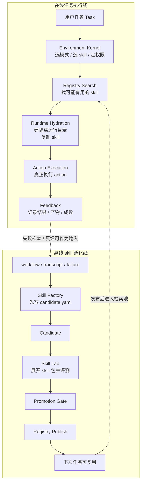
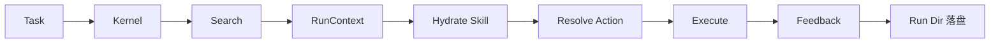
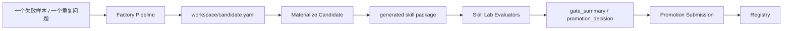
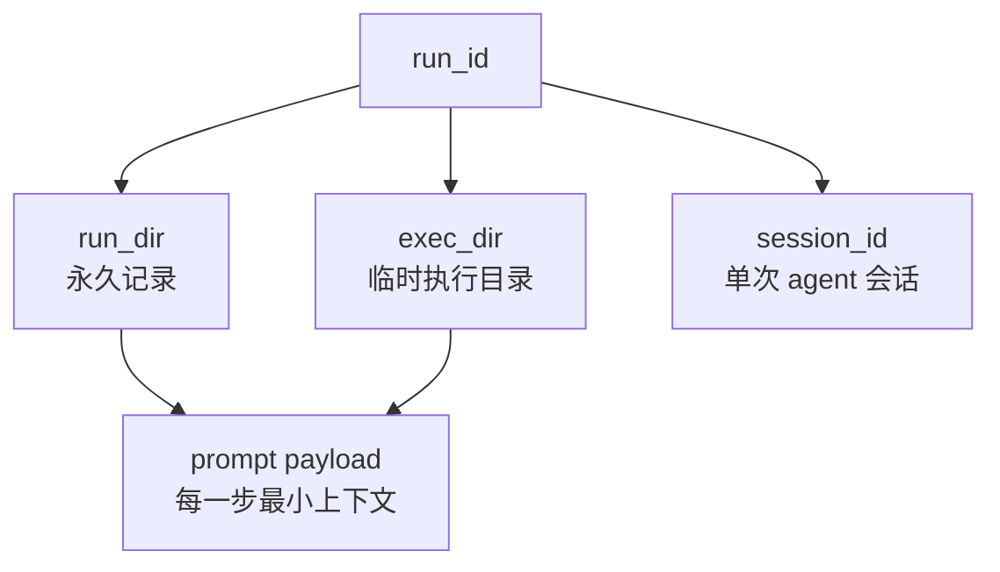

# 当前系统真实流转白话图解

日期：2026-04-04

这份文档只讲“当前代码真实怎么跑”。

不讲理想形态，不讲未来愿景，不把还没做完的能力当成已经落地。

目标只有 4 个：

1. 一眼看懂整套流转。
2. 看清每一步到底是程序在跑，还是 agent 在跑，还是要人介入。
3. 讲清楚 edge case 变 skill 现在靠什么在驱动。
4. 讲清楚上下文、会话、run、进程到底怎么管。

---

## 0. 先记住一句话

当前系统不是“一个超级 agent 自动自愈一切”。

当前真实形态更接近：

- 一条 **在线任务执行流水线**
- 一条 **离线 skill 孵化流水线**

两条线已经能接上，但 **还没有接成自动在线自愈闭环**。

也就是说：

- 线上任务失败后，系统会记录失败和反馈。
- 但它 **不会自动改线上 skill 并立刻重发**。
- 现在还是要把失败样本拿出来，再走一条单独的 factory / lab 流程，把它做成 candidate，再评估、再发布。

---

## 1. 一图看懂：当前其实是两条线

---

## 2. 每一步到底是谁在干活

| 步骤 | 当前主要是谁在干 | 说明 |
|---|---|---|
| `Task` 进入系统 | 程序 | `workflow/service.py` 统一调度 |
| `Environment Kernel` | 程序 | 选 mode、skill、sandbox、network |
| `Registry Search` | 程序 | manager/tree/vector 检索 |
| `Runtime Hydration` | 程序 | 建隔离目录，复制 skill |
| `Action Execution` | 混合 | 有些是脚本，有些会调用 agent |
| `Feedback` | 程序 | 写 `feedback.json`，可异步投递 |
| `Skill Factory` | 程序为主 | 把 failure/workflow/transcript 转成 `candidate.yaml` |
| `Skill Lab` | 程序 | 展开 skill 包、跑评测、算 gate |
| `Promotion Gate` | 程序 + 可能人工审核 | 高风险 action 会要求人工看 |
| `Registry Publish` | 程序 | 入库、存 bundle、记版本 |

### 2.1 Action Execution 里再拆一下

| action 类型 | 现在怎么跑 |
|---|---|
| `script` | 直接跑脚本 |
| `instruction` | 先准备 instruction，再交给 agent 执行 |
| `mcp` | 现在主要是程序化 wrapper，不是完整 agent 流程 |
| `subagent` | 现在只有合同和包装层，还不是完整 agent team 编排 |

一句话说白：

- `script` 是“程序自己干”
- `instruction` 是“程序先搭好台，再让 agent 干”
- `mcp` / `subagent` 现在还偏轻，还不是完整多代理系统

---

## 3. 在线任务线：现在到底怎么跑

### 3.1 简化成 6 步

1. 任务进来。
2. `Environment Kernel` 判断这次怎么跑。
3. 检索 skill。
4. 建一个隔离运行目录。
5. 选中具体 action。
6. 执行并写回反馈。

### 3.2 对应文件

- 总调度入口：`src/workflow/service.py`
- 环境判断：`src/environment/kernel.py`
- 隔离运行目录：`src/orchestrator/runtime/run_context.py`
- skill 安装：`src/orchestrator/runtime/install.py`
- action 解析：`src/orchestrator/runtime/resolve.py`
- action 执行：`src/orchestrator/runtime/runners.py`
- 反馈落盘：`src/orchestrator/runtime/feedback.py`

### 3.3 哪些地方会调用 agent

当前在线任务线里，agent 主要出现在这几种场景：

#### 场景 A：完全不走 skill

直接让 agent 做任务。

对应文件：

- `src/orchestrator/direct/engine.py`

它会开一个会话，`session_id` 类似：

- `direct-<run_id>`

#### 场景 B：freestyle 模式里选下一步 action

如果 action 不止一个，系统会先把 action 清单交给 agent，让它选下一步。

对应文件：

- `src/orchestrator/freestyle/engine.py`

会话名类似：

- `freestyle-select-<run_id>`

#### 场景 C：instruction action

这类 action 不是直接跑脚本，而是把 instruction 文本交给 agent 去执行。

会话名类似：

- `freestyle-instruction-<run_id>-<action_id>`
- `node-<node_id>-instruction`

#### 场景 D：DAG 规划

如果有多个 skill，要先出 plan。这个 plan 也是 agent 帮忙生成的。

对应文件：

- `src/orchestrator/dag/engine.py`

会话名类似：

- `orch-<task前缀>`

### 3.4 当前没有什么

当前没有一个“常驻 agent team”一直在后台盯着系统自动修技能。

现在是：

- 任务来了才开运行会话
- 规划时开规划会话
- instruction 节点才开 instruction 会话

不是：

- 系统里常驻多个 agent 各自维护自己的长期线程

---

## 4. edge case 变 skill：现在靠什么在驱动

这个问题最容易被想复杂。

当前没有什么神秘的“自愈大脑”。

现在所谓的“edge case 变 skill”，本质上是 **一个脚本优先的工厂流程**。

### 4.1 当前真实 harness 是什么

当前这条 harness 主要由 4 块组成：

1. `factory/src/python/skill_factory/pipeline.py`
   - 把 `workflow / transcript / failure` 组装成 `candidate.yaml`
2. `src/autoresearch_agent/packs/skill_research/builders/materialize_candidate.py`
   - 把 `candidate.yaml` 展开成完整 skill 包
3. `src/autoresearch_agent/core/skill_lab/pipeline.py`
   - 跑评测、产出 gate、给 promotion 决策
4. `src/agent_skill_platform/registry/service.py`
   - 发布、存储、版本化

所以现在的 harness 不是“一段长 prompt”。

它更像一条装配线：

- 先做 candidate
- 再做 package
- 再做评测
- 再做提交

### 4.2 一图看懂 edge case -> skill

### 4.3 当前它怎么开始

现在这一步 **不是主 runtime 自动触发**。

当前更真实的说法是：

- 线上任务失败了
- 系统会把 run、feedback、产物落盘
- 人或外部流程决定“这个失败值得沉淀成 skill”
- 然后再调用 factory / skill lab 这条离线流程

所以当前状态是：

- 已经有“失败 -> candidate”的工厂
- 但还没有“线上失败后自动进入工厂并自动改线上 skill”的闭环

### 4.4 当前 candidate 真正编辑面是什么

当前真正的编辑面是：

- `workspace/candidate.yaml`

不是直接去改：

- `SKILL.md`
- `manifest.json`
- `actions.yaml`
- `agents/interface.yaml`

因为这些文件在当前链路里是“生成物”。

---

## 5. 上下文怎么管：别把它想成一团 prompt

当前上下文不是只靠模型记忆。

它是 **文件上下文 + 会话上下文 + prompt 上下文** 三层一起管。

### 5.1 第一层：`run_id`

每次运行先有一个 `run_id`。

它是整次运行的编号。

有了它，系统才能把：

- 日志
- 结果
- 反馈
- 产物
- 后续状态查询

都串到一起。

### 5.2 第二层：`run_dir`

`run_dir` 是永久目录。

主要保存：

- `environment.json`
- `retrieval.json`
- `run_envelope.json`
- `result_envelope.json`
- `artifacts/`
- `feedback.json`

也就是说：

长期上下文主要靠文件，不靠 agent 自己记。

### 5.3 第三层：`exec_dir`

`exec_dir` 是临时执行目录。

它是这次运行真正干活的地方。

skill 会被复制进来，workspace 也在这里。

所以 agent 或脚本真正看到的是这个隔离目录，不是主仓裸目录。

### 5.4 第四层：`session_id`

只要需要 agent，会创建一个会话。

典型例子：

- `direct-<run_id>`
- `freestyle-select-<run_id>`
- `freestyle-instruction-<run_id>-<action_id>`
- `orch-<task前缀>`
- `node-<node_id>`

这个会话只对当前步骤或当前 run 有效，不是永久全局大脑。

### 5.5 第五层：prompt 里的上下文

真正发给 agent 的上下文是“按步骤裁剪过的”。

不是一股脑塞全部历史。

举例：

- action 选择时，只给 `task + action_catalog + prior_steps`
- instruction 执行时，只给 `task + instruction + output_dir + artifacts`
- DAG 规划时，只给 `task + skills摘要 + context`

这就是当前系统管理上下文的核心办法：

- 大上下文放磁盘
- 小上下文进 prompt

---

## 6. 线程、会话、进程：现在到底怎么创建

这个系统里有 3 个容易混淆的东西：

- run
- agent 会话
- lab 长任务进程

### 6.1 `run` 不是线程

`run` 更像“一次任务实例”。

它有自己的：

- `run_id`
- `run_dir`
- `exec_dir`

### 6.2 agent 会话不是系统线程

agent 会话主要是 `SkillClient(session_id=...)`。

它是和模型 SDK 的一段对话上下文，不等于操作系统线程。

### 6.3 Skill Lab 的异步任务才真的会起进程

如果走 MCP / 异步 job 模式，`run_project` 会被拉成一个独立子进程。

当前实现是：

1. 先生成 `run_id`
2. 用 `subprocess.Popen(...)` 启动运行进程
3. 把状态写进 `.autoresearch/state/mcp_jobs/<run_id>.json`
4. 再起一个 watcher thread 盯住这个进程何时结束

对应文件：

- `src/autoresearch_agent/mcp/server.py`
- `src/autoresearch_agent/mcp/job_store.py`

最关键的现实是：

- 当前有 **子进程**
- 当前有 **watcher thread**
- 但没有一个“多 agent team 自己拉很多长期线程协同工作”的落地系统

---

## 7. 约束到底怎么生效

当前主要有 4 类硬约束。

### 7.1 action 合同约束

`actions.yaml` 里先写清楚：

- action 类型
- 脚本入口
- runtime
- timeout
- sandbox
- 是否允许联网

### 7.2 运行前校验

执行前会校验：

- 如果是 `script`，入口文件必须存在
- 入口路径不能逃出 skill 包
- 请求的 sandbox 不能超过系统允许值
- 需要联网的 action，若策略不允许，会直接拦

### 7.3 运行时隔离

skill 会先复制到隔离目录，再执行。

这保证：

- 不直接污染主仓
- 不让 skill 随便跨边界找文件

### 7.4 lab gate

新 skill 在上线前还会过一轮轻量 gate：

- trigger
- action
- boundary
- governance
- resource
- safety

这不是线上运行约束，而是上线前门禁。

---

## 8. 现在最容易误解的地方

### 误解 1：系统已经能自动把失败修成 skill

不是。

当前只做到：

- 失败可被记录
- failure 可以作为 factory 输入
- candidate 可以被生成、评测、提交

还没做到：

- 线上失败自动进入工厂
- 自动多轮改 skill
- 自动回写生产 skill

### 误解 2：factory 主要靠 agent 长对话生成 skill

不是。

当前 factory 更像程序化装配线。

它主要做的是：

- 组 candidate
- 物化 package
- 跑 evaluators
- 出 promotion 结果

而不是开一个超长 agent 线程自己写完一切。

### 误解 3：上下文全靠 agent 记忆

不是。

当前上下文主要靠：

- run 目录文件
- artifact 文件
- session_id
- 每一步重新构造的 prompt

---

## 9. 最短记忆版

如果只记 6 句话，就记这 6 句：

1. 当前系统其实是两条线：在线任务线，和离线 skill 孵化线。
2. 在线任务线里，大部分步骤是程序化的；只有少数步骤会调用 agent。
3. 当前 agent 主要用在三件事：直跑任务、选 action、做 DAG 规划或 instruction 执行。
4. edge case 变 skill 现在不是自动自愈，而是走一条单独的工厂流程。
5. 这条工厂流程的真实编辑面是 `workspace/candidate.yaml`，不是直接手改整包 skill 文件。
6. 当前上下文主要靠 run 文件和 artifact 管理，不是靠某个长期常驻 agent 记住一切。
