# Agent Skill Platform 总览与复用映射

日期：2026-04-02  
状态：draft  
目标：把任务2收敛成可执行的多层工程方案，并明确每层复用哪些参考仓库模块

## 1. 文档目的

这份文档不替代各层详细设计，而负责回答四个总问题：

1. 整个平台应该拆成哪些层
2. 各层之间的边界是什么
3. 四个参考仓库里哪些代码值得直接复用，哪些只适合参考
4. 后续开发文档应该如何对应到工程模块和工作流

配套文档：

- [01-environment-kernel-and-runtime.md](/Users/chenge/Desktop/skills-gp-%20research/docs/engineering/01-environment-kernel-and-runtime.md)
- [02-skill-package-and-actions.md](/Users/chenge/Desktop/skills-gp-%20research/docs/engineering/02-skill-package-and-actions.md)
- [03-registry-search-governance.md](/Users/chenge/Desktop/skills-gp-%20research/docs/engineering/03-registry-search-governance.md)
- [04-skill-factory-and-lab.md](/Users/chenge/Desktop/skills-gp-%20research/docs/engineering/04-skill-factory-and-lab.md)
- [05-implementation-roadmap.md](/Users/chenge/Desktop/skills-gp-%20research/docs/engineering/05-implementation-roadmap.md)

## 2. 总体系统定义

目标系统不是单一 agent，也不是单一 registry，而是一套 `Environment-Native Agent Skill Platform`。

它至少包括五层：

1. `Skill Package Layer`
   - skill 的源代码结构、打包协议、兼容协议、action contract
2. `Environment Kernel & Runtime Layer`
   - skill 检索、模式选择、运行时装配、隔离执行、artifact 落盘
3. `Registry / Search / Governance Layer`
   - 发布、版本、审查、扫描、搜索、标签、下载、分发
4. `Skill Factory & Skill Lab Layer`
   - candidate 生成、受控实验、回归、晋升 gate
5. `Program Delivery Layer`
   - 开发分工、接口冻结、上线顺序、风险控制、迁移方案

### 2.1 总体关系图

```mermaid
flowchart LR
    A["Task / Transcript / Failure"] --> B["Environment Kernel"]
    B --> C["Registry Search"]
    C --> D["Skill Selection"]
    D --> E["Runtime Hydration"]
    E --> F["Action Execution"]
    F --> G["Run Artifacts + Feedback"]
    G --> H["Skill Factory"]
    H --> I["Candidate Skill"]
    I --> J["Skill Lab"]
    J --> K["Promotion Gate"]
    K --> L["Registry Publish"]
    L --> C
```



## 3. 各参考仓库的定位

### 3.1 `AgentSkillOS`

最值得复用的是运行时与分层检索，不是它当前的全部产品形态。

关键入口：

- [AgentSkillOS/ARCHITECTURE.md](/Users/chenge/Desktop/skills-gp-%20research/AgentSkillOS/ARCHITECTURE.md)
- [AgentSkillOS/src/manager/registry.py](/Users/chenge/Desktop/skills-gp-%20research/AgentSkillOS/src/manager/registry.py)
- [AgentSkillOS/src/orchestrator/registry.py](/Users/chenge/Desktop/skills-gp-%20research/AgentSkillOS/src/orchestrator/registry.py)
- [AgentSkillOS/src/orchestrator/runtime/run_context.py](/Users/chenge/Desktop/skills-gp-%20research/AgentSkillOS/src/orchestrator/runtime/run_context.py)
- [AgentSkillOS/src/workflow/service.py](/Users/chenge/Desktop/skills-gp-%20research/AgentSkillOS/src/workflow/service.py)

建议定位：

- 作为 `Environment Kernel & Runtime Layer` 的主来源

### 3.2 `skillhub`

最值得复用的是 registry、生命周期、搜索 projection、scanner、download 分发。

关键入口：

- [skillhub/docs/01-system-architecture.md](/Users/chenge/Desktop/skills-gp-%20research/skillhub/docs/01-system-architecture.md)
- [skillhub/docs/07-skill-protocol.md](/Users/chenge/Desktop/skills-gp-%20research/skillhub/docs/07-skill-protocol.md)
- [skillhub/docs/14-skill-lifecycle.md](/Users/chenge/Desktop/skills-gp-%20research/skillhub/docs/14-skill-lifecycle.md)
- [skillhub/server/skillhub-domain/src/main/java/com/iflytek/skillhub/domain/skill/service/SkillPublishService.java](/Users/chenge/Desktop/skills-gp-%20research/skillhub/server/skillhub-domain/src/main/java/com/iflytek/skillhub/domain/skill/service/SkillPublishService.java)
- [skillhub/server/skillhub-domain/src/main/java/com/iflytek/skillhub/domain/review/ReviewService.java](/Users/chenge/Desktop/skills-gp-%20research/skillhub/server/skillhub-domain/src/main/java/com/iflytek/skillhub/domain/review/ReviewService.java)
- [skillhub/server/skillhub-domain/src/main/java/com/iflytek/skillhub/domain/skill/service/SkillGovernanceService.java](/Users/chenge/Desktop/skills-gp-%20research/skillhub/server/skillhub-domain/src/main/java/com/iflytek/skillhub/domain/skill/service/SkillGovernanceService.java)
- [skillhub/server/skillhub-domain/src/main/java/com/iflytek/skillhub/domain/skill/service/SkillDownloadService.java](/Users/chenge/Desktop/skills-gp-%20research/skillhub/server/skillhub-domain/src/main/java/com/iflytek/skillhub/domain/skill/service/SkillDownloadService.java)

建议定位：

- 作为 `Registry / Search / Governance Layer` 的主来源

### 3.3 `yao-meta-skill`

最值得复用的是 skill authoring / validation / packaging / governance / evaluation contract。

关键入口：

- [yao-meta-skill/README.md](/Users/chenge/Desktop/skills-gp-%20research/yao-meta-skill/README.md)
- [yao-meta-skill/manifest.json](/Users/chenge/Desktop/skills-gp-%20research/yao-meta-skill/manifest.json)
- [yao-meta-skill/agents/interface.yaml](/Users/chenge/Desktop/skills-gp-%20research/yao-meta-skill/agents/interface.yaml)
- [yao-meta-skill/scripts/validate_skill.py](/Users/chenge/Desktop/skills-gp-%20research/yao-meta-skill/scripts/validate_skill.py)
- [yao-meta-skill/scripts/cross_packager.py](/Users/chenge/Desktop/skills-gp-%20research/yao-meta-skill/scripts/cross_packager.py)
- [yao-meta-skill/scripts/governance_check.py](/Users/chenge/Desktop/skills-gp-%20research/yao-meta-skill/scripts/governance_check.py)

建议定位：

- 作为 `Skill Package Layer` 和 `Skill Factory` 的主来源

### 3.4 `loomiai-autoresearch`

最值得复用的是受控研究 runtime、pack / project 脚手架、artifact 写出、MCP job lifecycle。

关键入口：

- [loomiai-autoresearch/docs/runtime-architecture.md](/Users/chenge/Desktop/skills-gp-%20research/loomiai-autoresearch/docs/runtime-architecture.md)
- [loomiai-autoresearch/src/autoresearch_agent/core/packs/schema.py](/Users/chenge/Desktop/skills-gp-%20research/loomiai-autoresearch/src/autoresearch_agent/core/packs/schema.py)
- [loomiai-autoresearch/src/autoresearch_agent/core/packs/project.py](/Users/chenge/Desktop/skills-gp-%20research/loomiai-autoresearch/src/autoresearch_agent/core/packs/project.py)
- [loomiai-autoresearch/src/autoresearch_agent/core/runtime/spec.py](/Users/chenge/Desktop/skills-gp-%20research/loomiai-autoresearch/src/autoresearch_agent/core/runtime/spec.py)
- [loomiai-autoresearch/src/autoresearch_agent/core/runtime/manager.py](/Users/chenge/Desktop/skills-gp-%20research/loomiai-autoresearch/src/autoresearch_agent/core/runtime/manager.py)
- [loomiai-autoresearch/src/autoresearch_agent/mcp/server.py](/Users/chenge/Desktop/skills-gp-%20research/loomiai-autoresearch/src/autoresearch_agent/mcp/server.py)

建议定位：

- 作为 `Skill Lab Layer` 的主来源

## 4. 复用策略总表

| 目标层 | 直接复用 | 受控改造复用 | 仅参考，不建议直接复用 |
|---|---|---|---|
| Skill Package | `yao-meta-skill` 的 `manifest.json`、`interface.yaml`、`validate_skill.py`、`cross_packager.py` | `skillhub` 的 `SKILL.md` 协议与目录兼容规则 | `AgentSkillOS` 当前对 skill 目录的隐式运行假设 |
| Environment Kernel | `AgentSkillOS` 的 `manager`/`orchestrator` 双轴、`RunContext`、`workflow/service.py` | active/dormant layering、engine mode、execution result 落盘 | 当前 UI 耦合结构 |
| Registry | `skillhub` 的 `Skill/SkillVersion/SkillFile`、publish/review/governance/download | search projection、label system、scanner async flow | 让 runtime 直接承担 review/governance |
| Skill Factory | `yao-meta-skill` 的 template、governance、packaging、eval contract | 把元 skill CLI 收敛成 candidate generator | 直接把 root meta skill 当生产 runtime |
| Skill Lab | `loomiai-autoresearch` 的 `project + runtime + MCP + artifacts` | editable target 从 strategy 拓展到 skill package | 当前 prediction_market 领域逻辑 |

## 5. 跨层接口

### 5.1 Registry -> Runtime

registry 向 runtime 暴露的不是“数据库实体”，而是 `RuntimeInstallBundle`。

建议契约：

```json
{
  "skillId": 101,
  "versionId": 1001,
  "slug": "github-pr-review",
  "bundleUrl": "s3://.../bundle.zip",
  "manifest": {},
  "actions": [],
  "environmentProfiles": [],
  "labels": [],
  "riskLevel": "medium",
  "publishedAt": "2026-04-02T00:00:00Z"
}
```

原因：

- runtime 不应该知道 registry 的内部 JPA/SQL 结构
- runtime 只关心“拿什么 bundle，带什么 metadata，允许跑哪些 action”

### 5.2 Runtime -> Registry

runtime 向 registry 回传的不是原始日志，而是 `RunFeedbackEnvelope`。

建议契约：

```json
{
  "runId": "run-20260402-001",
  "skillVersionId": 1001,
  "taskHash": "abc",
  "environmentHash": "def",
  "mode": "dag",
  "actionId": "run",
  "success": true,
  "latencyMs": 8420,
  "artifactIndex": [],
  "errorCode": null
}
```

这样 registry 才能：

- 做成功率快照
- 做推荐排序
- 做 candidate 发现
- 做 rollout / rollback 决策

### 5.3 Factory -> Lab

factory 产出的对象应是 `CandidateSkillPackage`，不是直接 publish 的生产版本。

最小交接物：

- candidate 源包目录
- candidate manifest
- candidate 评测计划
- 来源信息
- 推荐 editable targets

### 5.4 Lab -> Registry

lab 向 registry 提交的是 `PromotionSubmission`，不是直接写 `PUBLISHED`。

其中至少包含：

- candidate id
- eval score
- regression report
- governance score
- safety verdict
- recommended rollout strategy

## 6. 开发文档与模块映射

### 6.1 `01-environment-kernel-and-runtime.md`

回答：

- 怎么从 `AgentSkillOS` 迁出 Environment Kernel
- manager axis / orchestrator axis 怎么保留
- RunContext、runner、mode selection、layering 怎么落

### 6.2 `02-skill-package-and-actions.md`

回答：

- skill 最小工程单元长什么样
- `SKILL.md`、`manifest.json`、`actions.yaml`、`interface.yaml` 分别负责什么
- 发布前、运行前、打包前如何校验

### 6.3 `03-registry-search-governance.md`

回答：

- registry 怎么建模
- publish/review/scan/governance/search/download 怎么布置
- runtime 和 registry 的边界在哪

### 6.4 `04-skill-factory-and-lab.md`

回答：

- candidate 如何生成
- lab project 如何组织
- eval / regression / promotion gate 如何落

### 6.5 `05-implementation-roadmap.md`

回答：

- 先做哪些，后做哪些
- 团队怎么拆分
- 哪些接口先冻结
- 每个阶段的 Definition of Done 是什么

## 7. 推荐的代码仓组织

推荐不要直接把所有东西混回一个现有仓库目录，而应形成清晰模块边界。

### 方案 A：单 monorepo，多模块

```text
agent-skill-platform/
├── packages/skill-contracts
├── services/skill-registry
├── services/skill-lab
├── runtimes/environment-kernel
├── runtimes/skill-runtime
└── skills/
```

优点：

- 接口一致
- 版本联动更容易
- 文档和 schema 更容易统一

### 方案 B：四仓协作

```text
skill-contract-repo
environment-runtime-repo
registry-repo
skill-lab-repo
```

优点：

- 组织独立
- 职责更清晰

缺点：

- 接口漂移风险更高

如果当前团队还在快速试错，优先建议方案 A。

## 8. 关键设计纪律

1. skill 检索与 task 编排必须是两条正交轴。
2. skill package 与 runtime install 必须是两个对象。
3. registry 和 runtime 必须解耦，registry 不执行 skill，runtime 不承担审查与治理。
4. search 必须使用 projection，而不是从主表拼接。
5. candidate 不得直接进入生产，必须经过 lab。
6. scanner、review、promotion 都必须留审计轨迹。
7. object storage 默认按最终一致和补偿机制设计，不假设强一致。
8. 任何 action 执行都必须显式声明，禁止隐式扫描 `scripts/` 自动运行。

## 9. 本阶段建议输出物

本轮设计工作最终建议输出以下文档包：

- 总览与复用映射
- 运行时详细设计
- skill package 详细设计
- registry 详细设计
- skill lab 详细设计
- 实施路线图

后续如果进入实现阶段，再补下面两类文档：

- API / event / schema 文档
- 数据库 migration 与目录迁移计划
