# v0.5 重构版开发计划：Skill Engine（Find + Execute 主链路）

## 0. 文档目的

这份文档是对 [v0.5devplan.md](/Users/chenge/Desktop/skills-gp- research/agent-skill-platform/docs/plan/v0.5devplan.md) 的重构版补充说明。

目标不是推翻原方案，而是把当前讨论过的几个关键判断收束成一个更容易落地、更容易理解的版本：

- 在线主链路先做 `Find + Execute`
- `User Agent` 和 `Skill Engine` 明确分层
- `Skill` 不再按“是否带脚本”做两套系统，而是统一 skill package，按 `type` 分发执行器
- `case / lab / promotion` 退到后台增强链路，不阻塞一期上线

一句话概括：

**v0.5 先把 Skill Engine 做成一个可产品化的“技能查找 + 技能执行”系统，再把 skill 自我进化做成后台闭环。**

---

## 1. 核心判断

### 1.1 三层分离

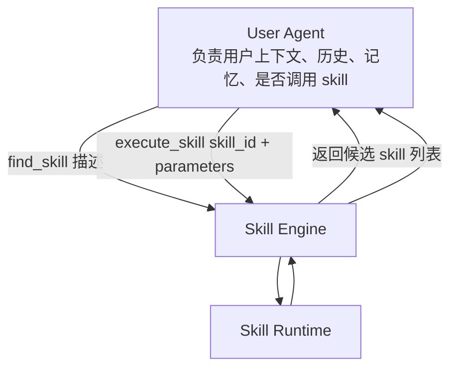

三层职责必须分开：

| 层 | 负责什么 | 不负责什么 |
|---|---|---|
| User Agent | 理解用户任务、管理长期上下文、决定是否调用 skill、组装参数 | skill 内部执行细节 |
| Skill Engine | `find_skill`、`execute_skill`、skill 元数据管理、执行分发 | 用户长期记忆、用户级编排 |
| Skill Runtime | skill install、action resolve、隔离执行、产出 artifact 和反馈 | 检索排序、用户理解、治理审核 |

### 1.2 在线和离线双环

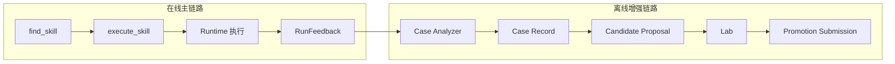

这意味着：

- 一期上线不要求自动生成新 skill
- 一期上线不要求自动多轮修 skill
- 一期核心是让 skill 可以被稳定找到、稳定执行、稳定回收反馈

---

## 2. 新版总体架构

### 2.1 总体关系图

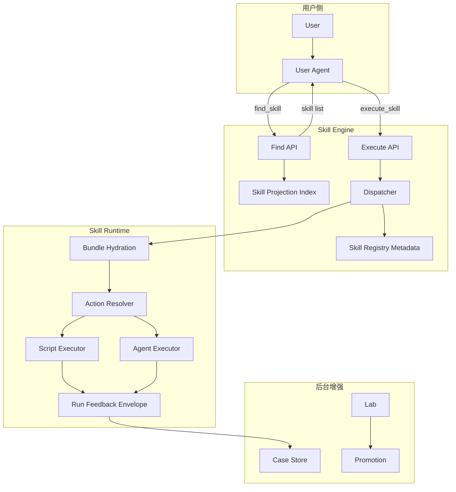

### 2.2 主线原则

1. Skill Engine 不持有 User Agent 的长期 context
2. Skill Engine 对外只暴露 `find_skill` 和 `execute_skill`
3. Runtime 只执行显式声明的 action，不执行任意脚本
4. Registry/Search 和 Runtime 解耦
5. Skill 进化不阻塞主执行链路

---

## 3. Skill 的三大类型

### 3.1 类型定义

| 类型 | 说明 | 执行方式 | 适合什么场景 |
|---|---|---|---|
| `script` | 固定计算逻辑，纯代码或接近纯代码 | 直接执行声明 action，不走 AI 决策 | 数据转换、校验、导出、格式化、解析 |
| `agent` | Markdown 规则 + 脚本 + 多步决策 | 内部起 Agent，按受限工具做多轮反应 | 多步骤流程、条件分支、组合多个动作 |
| `ai_decision` | 取数据后由 LLM 做判断、总结、选择 | 一期先复用 `AgentExecutor`，作为 `agent` 的策略 profile | 需要模型判断但工具面较窄的场景 |

### 3.2 不建议再拆成两套 Skill System

正确做法是：

- 只有一种 `SkillPackage`
- 通过 `skill.type` 区分执行器
- 通过 `actions.yaml` 控制可执行能力

错误做法是：

- Agent Skill 一套格式
- Script Skill 另一套格式
- AI Skill 再来一套格式

后者会导致：

- registry 资产格式分裂
- runtime 执行逻辑分叉
- lab/gate 规则无法统一

### 3.3 类型分发图

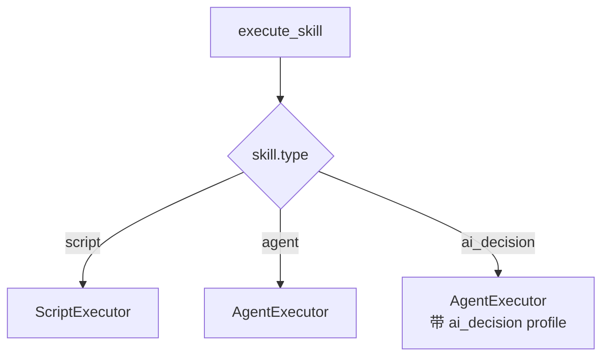

---

## 4. Skill Package 的具体形态

### 4.1 一个 Skill 的两个视图

一个 skill 同时有两种存在方式：

| 视图 | 用途 | 面向谁 |
|---|---|---|
| Projection View | 用于 `find_skill` 检索和展示 | Skill Engine / User Agent |
| Package View | 用于 `execute_skill` 实际执行 | Runtime |

### 4.2 Projection View

`find_skill` 不直接返回整个 skill 包，而是返回检索投影：

```yaml
skill_id: github-pr-review
display_name: GitHub PR Review
type: agent
inner_description: >
  review github pull request diff, summarize risks,
  inspect CI failures, produce actionable comments
outer_description: >
  Review a GitHub pull request, summarize risks, and provide
  actionable feedback for the caller.
parameter_schema:
  type: object
  required: [repo, pr_number]
default_action_id: review
risk_level: medium
tags:
  - github
  - review
  - ci
```

### 4.3 Package View

真正执行时，Runtime 消费的是 package：

```text
<skill-root>/
├── SKILL.md
├── manifest.json
├── actions.yaml
├── agents/
│   └── interface.yaml
├── references/
├── scripts/
├── assets/
└── evals/
```

### 4.4 Inner / Outer Description 的职责

| 字段 | 作用 | 面向谁 |
|---|---|---|
| `inner_description` | 检索召回、embedding、RAG 排序 | Search / Retrieval |
| `outer_description` | 给 User Agent 看，帮助其决定要不要调用 | User Agent / UI |

这个分离非常关键。

如果不分离，会出现两个问题：

- 为了检索召回把说明写得很“关键词堆砌”
- 为了展示自然语言把检索表达写得太模糊

---

## 5. Find Skill：怎么找

### 5.1 对外接口

```yaml
find_skill:
  input:
    description: string
    limit: integer
    filters:
      type: optional[string]
      tags: optional[list[string]]
  output:
    skills:
      - skill_id
      - display_name
      - type
      - outer_description
      - parameter_schema
      - risk_level
      - score
```

### 5.2 Find Skill 流程图

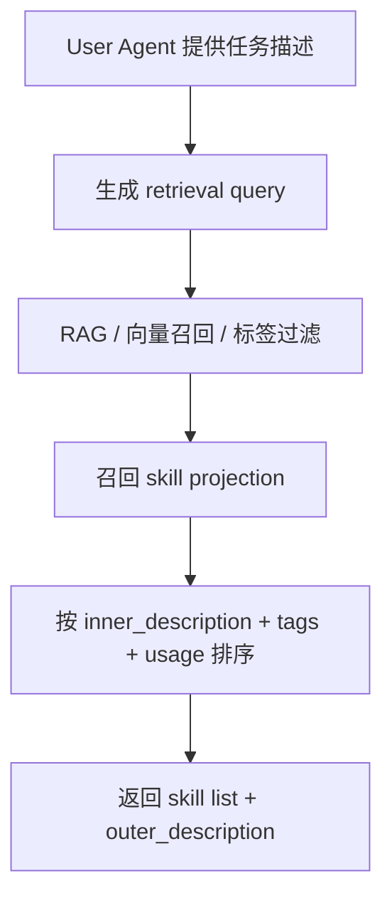

### 5.3 一期建议

- 一期先做 RAG + 元数据过滤
- skill 数量在几百级时，这已经足够
- 调优排序依赖真实使用反馈，不应一期过度设计

---

## 6. Execute Skill：怎么跑

### 6.1 对外接口

```yaml
execute_skill:
  input:
    skill_id: string
    parameters: object
    action_id: optional[string]
    environment_profile: optional[string]
    trace_id: optional[string]
  output:
    run_id: string
    status: string
    summary: string
    artifacts: list
    outputs: object
```

### 6.2 Execute Skill 时序图

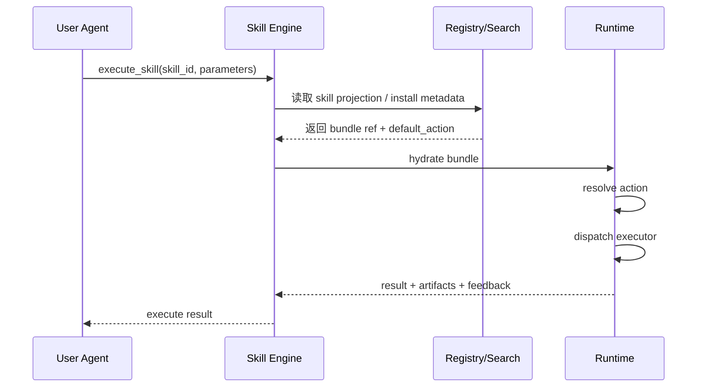

### 6.3 Runtime 内部执行图

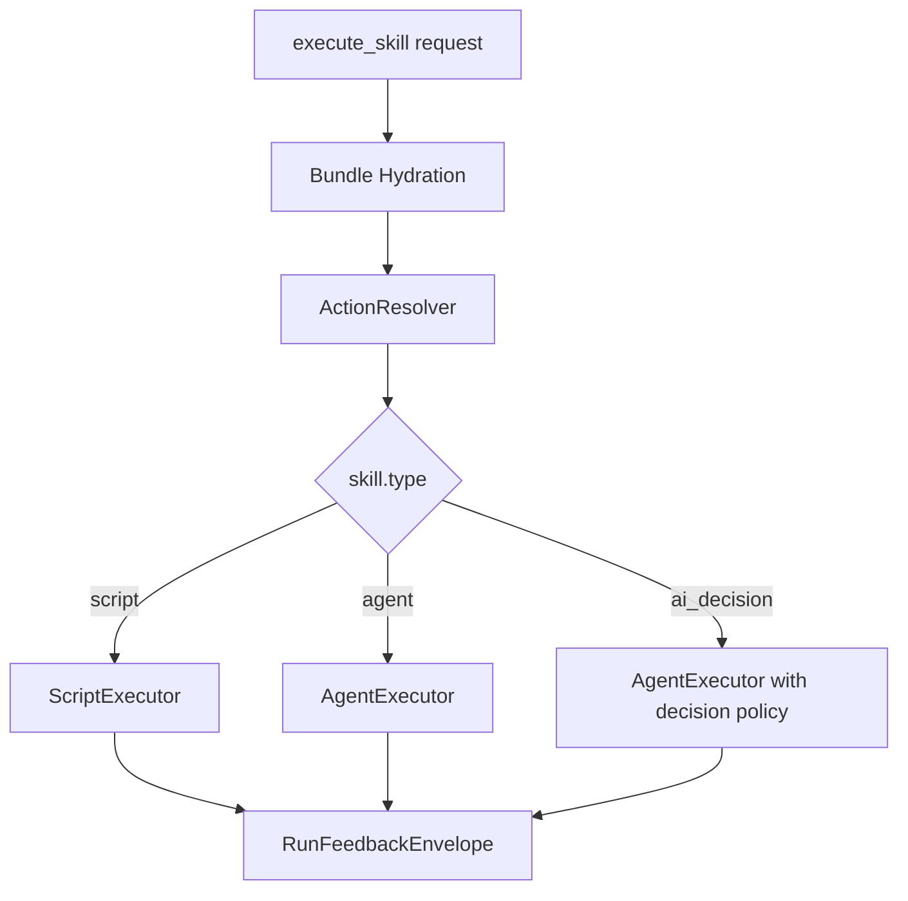

---

## 7. Runtime 的关键修正

### 7.1 Agent Runtime 最小工具面

Agent Skill 一期只开放两类工具：

| Tool | 作用 |
|---|---|
| `read_file(path)` | 读取 skill 包内部文件、参考文档、模板、资产说明 |
| `run_action(action_id, params)` | 执行 skill 中显式声明的 action |

### 7.2 为什么不是 `run_script(path, params)`

从产品名字上看，`run_script` 很直观；但从工程安全性看，真正应该暴露的是：

**`run_action(action_id, params)`**

原因：

1. runtime 已明确要求只能执行 `actions.yaml` 中声明过的 action
2. 直接给 path 会退回“任意脚本都能执行”的旧模式
3. action 能附带 timeout、sandbox、allow_network、schema 等 contract

所以推荐：

- 对外语义可以叫“运行某个 skill 动作”
- 内部实现必须做 action-level resolve

### 7.3 Script Skill 不走 AI

`script` 类型 skill 的执行必须尽量保持：

- deterministic
- schema-driven
- low-context
- no hidden planning

也就是说：

- Skill Engine 只负责路由到 `ScriptExecutor`
- `ScriptExecutor` 只按 contract 执行，不做 prompt 推理

---

## 8. Skill Engine 不是“大量 if-else”

### 8.1 正确认知

概念上它是路由器。

工程上它应该是：

**metadata-driven dispatcher**

而不是：

**hard-coded business if-else**

### 8.2 正确的 dispatch 依据

| 依据 | 用来决定什么 |
|---|---|
| `skill.type` | 用哪个 executor |
| `default_action_id` | 默认跑哪个 action |
| `risk_level` | 是否要求更严格执行环境 |
| `environment_profile` | 用哪个 runtime profile |
| `parameter_schema` | 参数是否合法 |

### 8.3 路由关系图

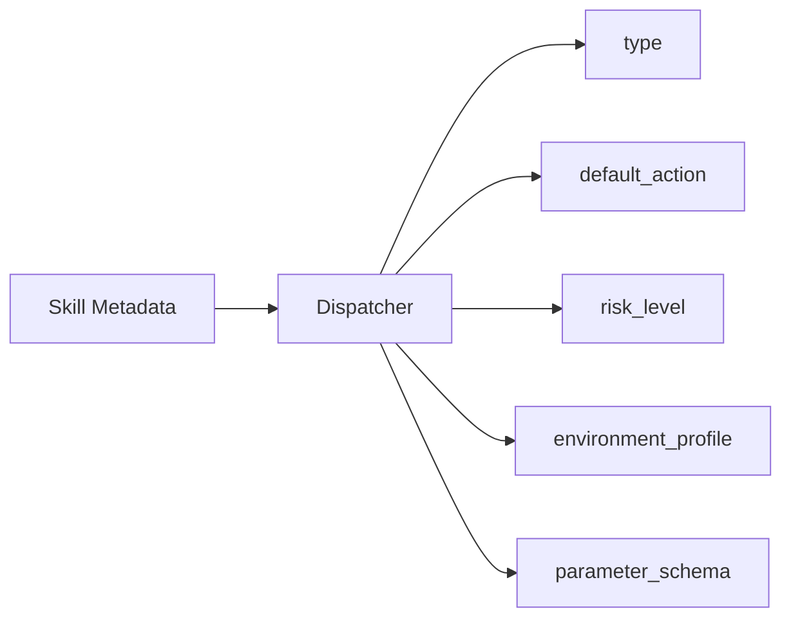

---

## 9. Registry / Search / Runtime 的关系

### 9.1 关系图

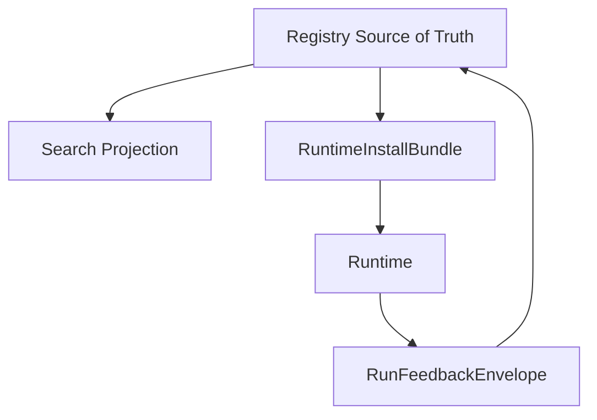

### 9.2 各对象职责

| 对象 | 责任 |
|---|---|
| `Search Projection` | 只负责 `find_skill` |
| `RuntimeInstallBundle` | 只负责执行前安装和 action resolve 所需信息 |
| `RunFeedbackEnvelope` | 只负责执行反馈 |
| `PromotionSubmission` | 只负责 lab 晋升提交 |

这几个对象不能混用。

---

## 10. Skill 与 Action 的关系

### 10.1 为什么执行最小单元是 Action

Skill 是资产单元。

Action 是执行单元。

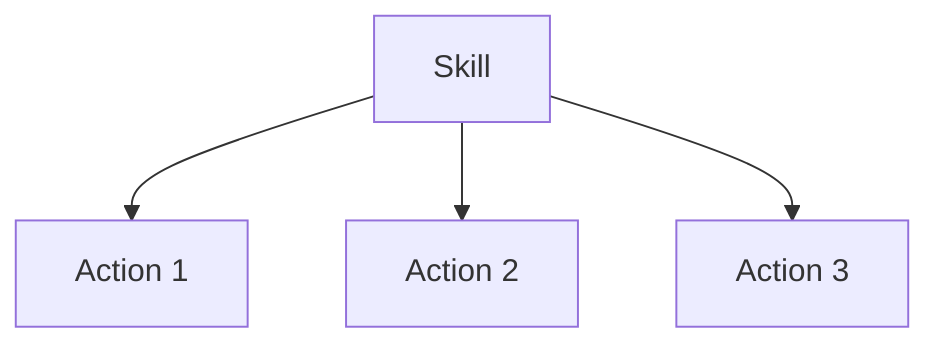

举例：

| Skill | Action |
|---|---|
| `github-pr-review` | `review` / `triage_ci` / `summarize` |
| `csv-cleaner` | `clean_csv` / `validate_schema` |
| `research-brief-agent` | `collect_sources` / `draft_brief` |

所以 `execute_skill` 的默认语义应是：

- 用 skill 的 `default_action_id`
- 如调用方显式指定 `action_id`，则执行指定 action

---

## 11. 后台增强链路：保留，但不做在线主路径

### 11.1 为什么还需要 Case / Lab

虽然一期主链路改成了 `Find + Execute`，但后台闭环仍然有价值，因为它负责：

- 分析 edge case
- 决定 patch 还是 create
- 做回归和治理门禁
- 决定哪些 official skill 可以晋升

### 11.2 后台增强流程图

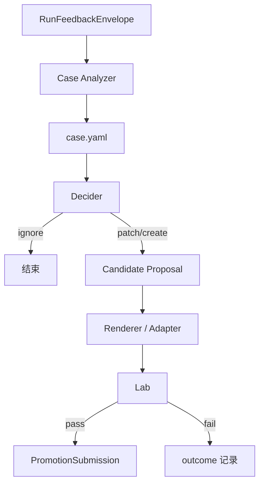

### 11.3 这里的关键降级

一期不要求：

- 自动生成真实脚本逻辑
- 自动多轮修 skill 直到通过
- 自动 publish

一期只要求：

- 有 case 记录
- 有 outcome 记录
- 有 lab 晋升入口

---

## 12. 新版 v0.5 的实施顺序

### Phase A：先冻结 Skill Schema 和 Projection

目标：

- 先把 skill 注册格式和 `find_skill` 返回格式统一

交付：

- `skill.type`
- `inner_description`
- `outer_description`
- `parameter_schema`
- `default_action_id`
- `risk_level`

验收：

- 任意 skill 都能被注册成统一 projection
- `find_skill` 返回结果稳定可用

### Phase B：打通 Execute 主链路

目标：

- 从 `execute_skill` 到 runtime 执行打通

交付：

- `execute_skill` MCP 接口
- bundle hydration
- action resolve
- script skill 执行
- `RunFeedbackEnvelope`

验收：

- `script` 类型 skill 可稳定执行
- 反馈可稳定落盘和回传

### Phase C：增加 Agent Skill MVP

目标：

- 支持受限 agent skill

交付：

- `AgentExecutor`
- `read_file`
- `run_action`
- 官方 skill 的 agent 运行模板

验收：

- agent skill 可在受限工具面下稳定完成多步流程

### Phase D：把 AI 决策型并入 Agent Profile

目标：

- 让 `ai_decision` 在不额外引入第三套 runtime 的前提下落地

交付：

- `ai_decision` profile
- 输出 schema
- 成本/风控记录

验收：

- `ai_decision` skill 可以被检索、执行、记录反馈

### Phase E：接回后台增强链路

目标：

- 把原来 v0.5 的 `case / lab / promotion` 作为后台演化系统接回

交付：

- `case.yaml`
- `CandidateProposal`
- `Lab`
- `PromotionSubmission`

验收：

- 不影响在线主链路
- 能支持 official skills 的离线 patch/create/晋升

---

## 13. 关键风险和防线

### 13.1 风险一：`ai_decision` 和 `agent` 边界模糊

防线：

- 一期不拆两套 executor
- `ai_decision` 只是 `agent` 的一种 profile

### 13.2 风险二：`run_script(path)` 破坏显式 action contract

防线：

- 内部统一改成 `run_action(action_id, params)`
- action 必须来自 `actions.yaml`

### 13.3 风险三：把 Learning 链路重新塞回在线主线

防线：

- `case / lab / promotion` 只走后台
- 线上只依赖 `find_skill` 和 `execute_skill`

### 13.4 风险四：Schema 过早膨胀

防线：

- 一期只冻结最小字段
- usage ranking / 成本控制 / 高级 profile 放到二期

---

## 14. 一页总结

如果只记住最重要的几句话，记这 8 条：

1. `User Agent` 和 `Skill Engine` 必须解耦。
2. Skill Engine 不持有用户长期上下文。
3. Skill Engine 对外只暴露 `find_skill` 和 `execute_skill`。
4. Skill 只有一种 package，不做多套资产格式。
5. Skill 按 `type` 分成 `script / agent / ai_decision`。
6. Runtime 执行最小单元是 action，不是任意脚本文件。
7. 在线主链路先做 `Find + Execute`。
8. `case / lab / promotion` 退到后台增强链路。

最终目标架构如下：

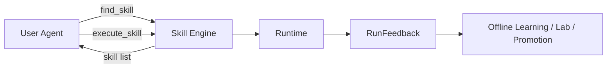

这就是新版 v0.5 最核心的收口：

**先把 Skill Engine 做成产品，再把 Skill 进化做成后台系统。**
