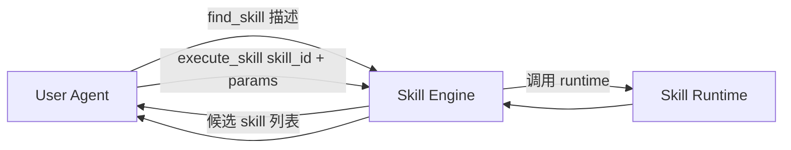
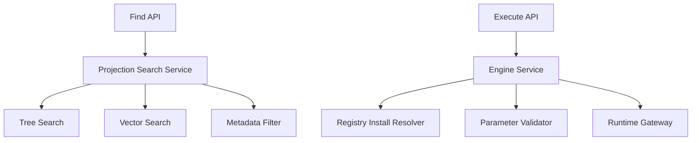

# v0.5A 开发规划：Skill Engine（Find + Execute）

## 0. 文档定位

这份文档只负责 `Skill Engine`。

这里的 `Skill Engine` 指：

- `find_skill`
- `execute_skill`
- skill projection / metadata
- search / ranking
- 从 `skill_id` 到 runtime 执行请求的分发

不负责：

- runtime 内部 action resolve / runner 细节
- case / lab / promotion 的后台增强

这份文档的目的，是给后续单独 subagent 一个清晰边界，让它只做 “技能怎么找、怎么发起执行”。

---

## 1. 目标

`Skill Engine` 一期要落成下面这个最小产品形态：



对外只暴露两个接口：

- `find_skill`
- `execute_skill`

一句话目标：

**先把 skill 做成一个可查找、可调用的标准能力资产。**

---

## 2. 当前代码基线

### 2.1 当前已有能力

当前仓库里和 `Skill Engine` 最接近的代码分布如下：

| 能力 | 当前代码 |
|---|---|
| tree 检索 | `src/manager/tree/searcher.py` |
| vector 检索 | `src/manager/vector/searcher.py` |
| kernel / plugin 封装 | `src/agent_skill_platform/platform.py` |
| registry 列表 / 查询 / publish | `src/agent_skill_platform/registry/service.py` |
| registry API | `src/agent_skill_platform/registry/api.py` |

### 2.2 当前真实状态

当前代码已经有“检索”和“执行相关入口”，但还没有形成新的 `Skill Engine` 产品面。

现状可以概括成：

1. 搜索能力存在，但还是偏底层 manager/searcher
2. registry 可以 `list/get/publish/install-bundle`
3. runtime 可以直接 `run_runtime(package_root, action_id, input)`
4. 缺一个真正以 `skill_id` 为中心的引擎层

### 2.3 当前缺口

从新架构看，当前缺口主要有 5 个：

| 缺口 | 当前情况 |
|---|---|
| `find_skill` 产品接口 | 没有统一接口，只是底层 searcher |
| `execute_skill(skill_id, params)` | 没有 engine 层服务，只有 runtime 直接跑 package |
| projection schema | 没有 `inner_description / outer_description / type / parameter_schema` 的统一投影 |
| registry-backed retrieval | 当前检索更多依赖本地 tree/vector 元数据，不是 registry projection |
| engine dispatcher | 还没有从 `skill_id -> install bundle -> runtime` 的专门服务层 |

---

## 3. 目标架构

### 3.1 Engine 内部结构



### 3.2 Engine 负责的对象

| 对象 | 作用 |
|---|---|
| `SkillProjection` | 给 `find_skill` 用的检索和展示对象 |
| `FindSkillRequest` | 用户侧传入的描述和过滤条件 |
| `FindSkillResponse` | 返回的候选 skill 列表 |
| `ExecuteSkillRequest` | 传入 `skill_id + parameters + optional action_id` |
| `ExecuteSkillResponse` | 返回运行结果摘要、artifact、feedback ref |

### 3.3 SkillProjection 建议字段

```yaml
skill_id: github-pr-review
display_name: GitHub PR Review
type: agent
inner_description: review github pull requests, triage ci, summarize risk
outer_description: Review a GitHub PR and return actionable feedback
parameter_schema:
  type: object
default_action_id: review
risk_level: medium
tags:
  - github
  - review
  - ci
is_official: true
latest_version_id: "1.2.0"
```

---

## 4. 代码边界与改动面

### 4.1 本文 owner 的文件

这块建议由 `Skill Engine` subagent 负责：

```text
src/agent_skill_platform/platform.py
src/agent_skill_platform/registry/service.py
src/agent_skill_platform/registry/api.py
src/manager/tree/searcher.py
src/manager/vector/searcher.py
```

建议新增：

```text
src/agent_skill_platform/engine/
├── __init__.py
├── models.py
├── service.py
├── search.py
└── api.py
```

### 4.2 不属于本文 owner 的文件

这些文件只能读，不应在这一块里重写：

```text
src/orchestrator/runtime/*
src/autoresearch_agent/core/skill_lab/*
src/agent_skill_platform/lab/*
```

原因：

- runtime 细节属于 `Skill Runtime`
- lab / promotion 属于 `后台增强`

---

## 5. 开发阶段

## Phase 1：Projection Schema 冻结

### 目标

先把 `find_skill` 需要的 skill 投影结构冻结下来。

### 交付项

- 新增 `SkillProjection`
- 新增 `FindSkillRequest`
- 新增 `FindSkillResponse`
- 新增 `ExecuteSkillRequest`
- 新增 `ExecuteSkillResponse`

### 具体任务

1. 在 `src/agent_skill_platform/engine/models.py` 定义上述对象
2. 在 registry service 增加 projection 输出函数
3. 确定 `inner_description / outer_description / type / parameter_schema / default_action_id` 为一期必填字段

### 验收标准

- engine 层对象不再直接暴露 package 根目录和内部结构
- `find_skill` 返回结果结构稳定

---

## Phase 2：Registry Projection 输出

### 目标

让 registry 不只是 `list_skills/get_skill`，还可以输出可检索 projection。

### 交付项

- registry 中增加 projection 读取面
- projection 可从包中构建
- `type`、`display_name`、描述字段可持久化

### 具体任务

1. 扩展 `RegistryService.publish_package()`，在 publish 时提取 projection 信息
2. 扩展 `RegistryService.get_skill()` 返回 projection
3. 新增 `RegistryService.search_projections()` 或等价 service
4. registry API 增加 `/find-skill` 或 `/skills/search`

### 依赖

- 依赖 package contract 中能读到 skill 基础元数据
- 不依赖 runtime 改造完成

### 验收标准

- skill 发布后可立即进入 projection 查询面
- projection 返回不依赖原始 tree 文件

---

## Phase 3：统一 FindSkill Service

### 目标

把 tree/vector 搜索封装成一个 engine search service。

### 交付项

- `EngineSearchService`
- 支持 RAG / vector / tag filter
- 返回统一的 `SkillProjection[]`

### 具体任务

1. 在 `src/agent_skill_platform/engine/search.py` 封装搜索入口
2. 复用 `src/manager/tree/searcher.py`
3. 复用 `src/manager/vector/searcher.py`
4. 做最小排序策略：
   - semantic score
   - `is_official`
   - usage stats 预留

### 非目标

- 一期不做复杂 learning-to-rank
- 一期不做跨 registry federation

### 验收标准

- `find_skill` 从 engine 层调用，不再由上层直接碰 manager 插件
- 返回结果可直接给 User Agent 使用

---

## Phase 4：ExecuteSkill Service

### 目标

新增真正的 `execute_skill(skill_id, parameters)` 引擎服务。

### 交付项

- `EngineService.execute_skill()`
- 从 registry 解析 install bundle
- 做参数校验
- 调用 runtime gateway

### 具体任务

1. 在 `src/agent_skill_platform/engine/service.py` 新增 engine service
2. `execute_skill` 步骤固定为：
   - 读 projection / registry metadata
   - resolve install bundle
   - 参数按 schema 校验
   - 调 runtime
   - 返回标准 response
3. 在 `src/agent_skill_platform/platform.py` 暴露对应能力

### 验收标准

- 上层不再需要知道 package path
- 用户侧只凭 `skill_id + parameters` 即可调用

---

## Phase 5：MCP / API 对外产品化

### 目标

把 `find_skill` 和 `execute_skill` 做成统一产品接口。

### 交付项

- `engine/api.py`
- FastAPI 或 MCP tool mapping
- request/response 示例

### 具体任务

1. 新增 `/find-skill`
2. 新增 `/execute-skill`
3. 在平台 facade 中统一导出
4. 为后续 MCP 包装准备稳定接口

### 验收标准

- 外部系统不需要理解 runtime 细节
- 对外接口只剩两个

---

## 6. 子任务拆分建议

### Subagent A：Projection / Registry

负责：

- `SkillProjection` schema
- registry projection 持久化与查询
- `/skills/search` 或等价接口

不负责：

- runtime 调度
- lab / promotion

### Subagent B：Find Skill Service

负责：

- tree/vector 检索适配
- unified search service
- `find_skill` 排序和过滤

不负责：

- execute runtime
- registry 存储结构迁移

### Subagent C：Execute Skill Service

负责：

- `execute_skill`
- 请求校验
- registry bundle resolve
- runtime gateway 对接

不负责：

- runtime runner 实现本身

---

## 7. 关键接口草案

### 7.1 `find_skill`

```yaml
input:
  description: string
  limit: integer
  filters:
    type: optional[string]
    tags: optional[list[string]]

output:
  skills:
    - skill_id
    - display_name
    - type
    - outer_description
    - parameter_schema
    - default_action_id
    - risk_level
    - score
```

### 7.2 `execute_skill`

```yaml
input:
  skill_id: string
  parameters: object
  action_id: optional[string]
  trace_id: optional[string]

output:
  run_id: string
  status: string
  summary: string
  outputs: object
  artifacts: list
  feedback: object
```

---

## 8. 风险

### 风险 1：projection 和 package 元数据重复

处理：

- package 是 source of truth
- projection 是 registry/search 侧派生物

### 风险 2：tree/vector 搜索和 registry projection 双源不一致

处理：

- 一期允许双源并存
- 二期逐步让 registry projection 成为主检索面

### 风险 3：`execute_skill` 过早侵入 runtime 细节

处理：

- engine 只做 gateway，不做 runner 逻辑
- runner 细节仍由 runtime 层负责

---

## 9. 完成定义

这块完成的标志不是“搜索代码能跑”，而是下面 5 件事同时成立：

1. Skill 以统一 projection 形式可检索
2. `find_skill` 返回结果可直接给 User Agent 用
3. `execute_skill` 不再要求上层知道 package 路径
4. engine 层与 runtime 层职责清晰
5. 后续 subagent 可以只围绕 engine 模块继续演进，不需要动 lab/runtime 内核
