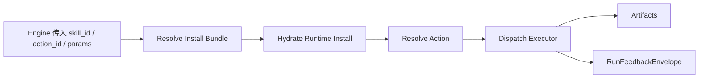
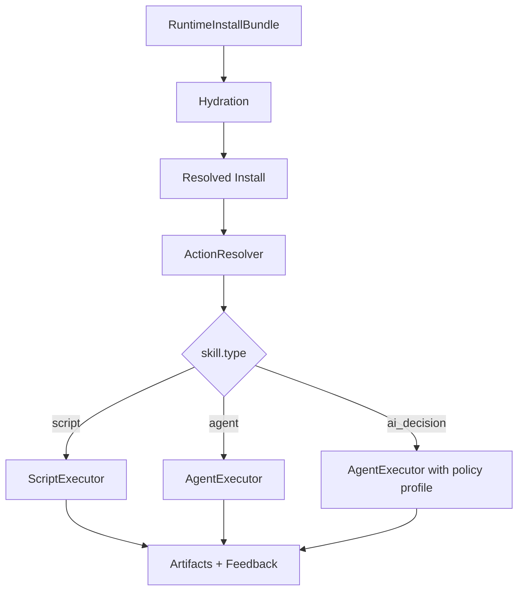

# v0.5B 开发规划：Skill Runtime（Install + Resolve + Dispatch）

## 0. 文档定位

这份文档只负责 `Skill Runtime`。

这里的 runtime 指：

- install bundle
- runtime install hydration
- action resolve
- executor dispatch
- workspace / sandbox / feedback

不负责：

- `find_skill`
- registry projection / search
- case / lab / promotion

这份文档是给 runtime subagent 的开发边界说明。

---

## 1. 目标

`Skill Runtime` 的目标，是把一个已选定的 skill 变成一次安全、可回放、可审计的执行。



一句话目标：

**runtime 不负责决定跑哪个 skill，它只负责把已选定的 skill 跑对。**

---

## 2. 当前代码基线

### 2.1 当前已有能力

当前 runtime 基础能力已经比较完整，主要代码集中在：

```text
src/agent_skill_platform/runtime/__init__.py
src/orchestrator/runtime/actions.py
src/orchestrator/runtime/install.py
src/orchestrator/runtime/resolve.py
src/orchestrator/runtime/runners.py
src/orchestrator/runtime/run_context.py
src/orchestrator/runtime/envelope.py
src/orchestrator/runtime/feedback.py
```

### 2.2 当前真实状态

当前 runtime 已经具备：

| 能力 | 当前状态 |
|---|---|
| `RuntimeInstallBundle` | 已有 |
| package hydration | 已有 |
| `ActionResolver` | 已有 |
| `script / mcp / instruction / subagent` action kind | 已有 |
| `RunnerRegistry` | 已有 |
| `RunFeedbackEnvelope` | 已有 |

### 2.3 当前缺口

和新架构对照，runtime 还缺这几块：

| 缺口 | 当前情况 |
|---|---|
| skill-level `type` dispatch | 当前主要按 action kind 跑，不按 skill.type 分发 |
| `AgentExecutor` | 还没有新的“受限 agent skill executor” |
| `run_action` 工具语义 | 现有 runtime 直接执行 resolved action，但没有 agent tool surface |
| runtime profile 与 skill type 结合 | 目前更多是 sandbox/network cap，不是 skill execution profile |
| action schema 到 engine 接口的完整贯通 | 当前存在 contract，但没有新 `execute_skill` 链路接入 |

---

## 3. 目标架构

### 3.1 Runtime 内部结构



### 3.2 Runtime 的三个核心对象

| 对象 | 责任 |
|---|---|
| `RuntimeInstallBundle` | registry 给 runtime 的 execution-ready 输入 |
| `ResolvedAction` | runtime 内部确定要执行哪个 action |
| `ActionResult / RunFeedbackEnvelope` | 执行完成后的结果和反馈 |

---

## 4. 代码边界与改动面

### 4.1 本文 owner 的文件

建议 `Skill Runtime` subagent 只负责：

```text
src/agent_skill_platform/runtime/__init__.py
src/orchestrator/runtime/actions.py
src/orchestrator/runtime/install.py
src/orchestrator/runtime/resolve.py
src/orchestrator/runtime/runners.py
src/orchestrator/runtime/run_context.py
src/orchestrator/runtime/envelope.py
src/orchestrator/runtime/feedback.py
```

建议新增：

```text
src/orchestrator/runtime/executors/
├── __init__.py
├── script_executor.py
├── agent_executor.py
└── profiles.py
```

### 4.2 不属于本文 owner 的文件

这些文件只作为依赖输入，不在 runtime 文档里重写：

```text
src/agent_skill_platform/registry/*
src/manager/*
src/autoresearch_agent/core/skill_lab/*
```

---

## 5. 开发阶段

## Phase 1：把 Skill Type 引入 Runtime

### 目标

让 runtime 从“只认识 action kind”升级为“既认识 action kind，也认识 skill.type”。

### 交付项

- package / manifest / projection 中可读取 `skill.type`
- runtime install 中保留 `skill.type`
- resolve 结果中带上 type 信息

### 具体任务

1. 扩展 runtime install metadata
2. 扩展 `ResolvedAction` 或等价 runtime context
3. 在 `run_runtime()` 中预留按 `skill.type` 分发的入口

### 验收标准

- runtime 在执行前能知道当前 skill 属于 `script / agent / ai_decision`

---

## Phase 2：Script Runtime 收口

### 目标

把 `script` 类型 skill 的路径收敛为“标准 contract 驱动执行”。

### 交付项

- `script` 类型统一走 `ScriptExecutor`
- `action_id` 来自 `actions.yaml`
- 更清晰的执行错误语义

### 具体任务

1. 复核 `ActionResolver` 对 runtime、sandbox、entry 的校验
2. 复核 `ScriptRunner` 对 stdout/stderr/payload 的标准化
3. 明确 `script` skill 默认不走 LLM，不走规划

### 验收标准

- script skill 的行为 deterministic
- 错误码和 artifacts 可稳定回放

---

## Phase 3：AgentExecutor MVP

### 目标

新增受限的 `AgentExecutor`，支撑 `agent` 类型 skill。

### 交付项

- `AgentExecutor`
- runtime 内部的 tool surface
- `read_file`
- `run_action`

### 关键原则

Agent skill 一期只允许受控工具面。

```mermaid
flowchart TD
    A[AgentExecutor] --> B[read_file(path)]
    A --> C[run_action(action_id, params)]
```

### 重点说明

这里不建议暴露 `run_script(path, params)`。

原因：

- 会绕过 `actions.yaml`
- 会退回“任意脚本可执行”
- 无法复用 timeout / sandbox / schema contract

所以实现上必须是：

- `run_action(action_id, params)`

### 验收标准

- agent skill 可在受限工具面下完成多步任务
- 工具调用仍然经过 runtime contract

---

## Phase 4：AI Decision Profile

### 目标

支持 `ai_decision`，但不新增第三套 executor。

### 交付项

- `ai_decision` 作为 `AgentExecutor` 的 profile
- profile 控制：
  - 工具范围
  - 结果 schema
  - token/cost 记录

### 原因

`agent` 和 `ai_decision` 的执行模型高度重合。

一期不值得：

- 再拆一套 runtime
- 再定义一套调度 contract

### 验收标准

- `ai_decision` skill 可以被 runtime 稳定执行
- 仍复用同一套 feedback / artifact 基础设施

---

## Phase 5：Execute Chain 接入 Engine

### 目标

把 runtime 作为 engine 的可调用网关稳定下来。

### 交付项

- 明确 `run_runtime()` 的 engine-facing response
- `execute_skill` 可以稳定依赖 runtime

### 具体任务

1. 固定 runtime response shape
2. 固定 feedback shape
3. 固定 artifact shape
4. 和 engine 文档对齐 request/response

### 验收标准

- engine 不需要理解 runner 细节
- runtime 返回结构足够稳定供 API 使用

---

## 6. 子任务拆分建议

### Subagent A：Install + Resolve

负责：

- install bundle
- hydration
- resolve
- metadata 贯通

不负责：

- agent executor
- lab / promotion

### Subagent B：Script Runtime

负责：

- script execution path
- runner output normalization
- artifacts / error semantics

不负责：

- search / registry

### Subagent C：AgentExecutor

负责：

- `AgentExecutor`
- `read_file`
- `run_action`
- `ai_decision` profile

不负责：

- engine search
- registry projection

---

## 7. 建议的接口与对象

### 7.1 Runtime 输入

```yaml
RuntimeExecutionRequest:
  skill_id: string
  version_id: optional[string]
  action_id: optional[string]
  skill_type: string
  parameters: object
  environment_profile: optional[string]
  trace_id: optional[string]
```

### 7.2 Runtime 输出

```yaml
RuntimeExecutionResponse:
  run_id: string
  resolved_action: object
  result: object
  artifacts: list
  feedback: object
```

---

## 8. 风险

### 风险 1：skill.type 和 action.kind 混淆

处理：

- `skill.type` 决定 executor 路线
- `action.kind` 决定具体 runner 语义

### 风险 2：AgentExecutor 破坏现有 runtime contract

处理：

- Agent 只能通过 `run_action`
- 不能直接执行任意 path

### 风险 3：runtime 过早承担 search / orchestration 责任

处理：

- runtime 不负责选 skill
- runtime 不负责 find 接口

---

## 9. 完成定义

Runtime 这块完成的标志是：

1. runtime 能识别 `skill.type`
2. `script` 类型 skill 稳定执行
3. `agent` 类型 skill 有受限 executor
4. `ai_decision` 以 profile 方式接入
5. engine 可以通过 runtime 网关稳定发起执行
