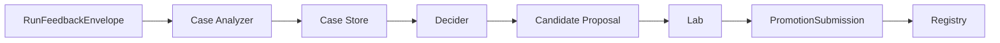
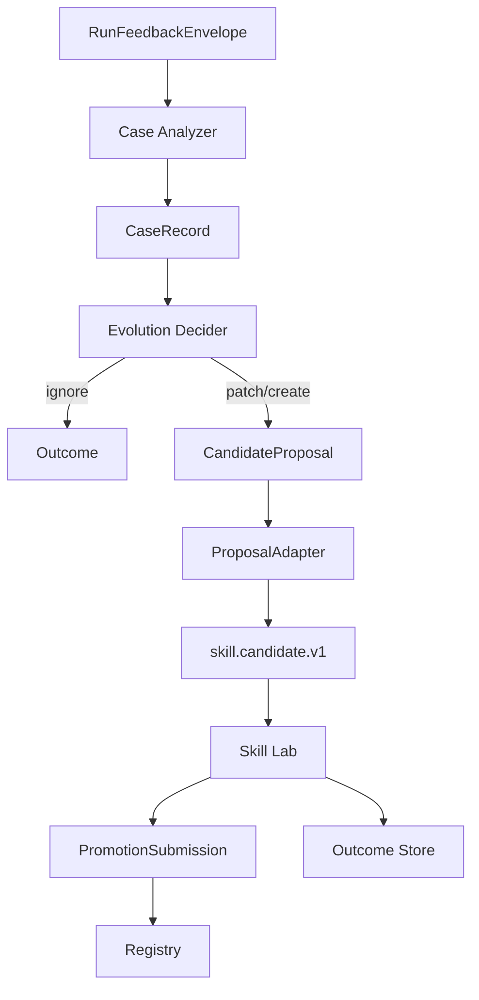

# v0.5C 开发规划：后台增强（Case + Lab + Promotion）

## 0. 文档定位

这份文档只负责后台增强链路。

这里的后台增强包括：

- `RunFeedback -> CaseRecord`
- `CandidateProposal`
- `Lab`
- `PromotionSubmission`
- official skill 的离线 patch/create/晋升

不负责：

- `find_skill`
- `execute_skill`
- runtime 内部 runner 细节

这是一个后台系统，不是一期开启的在线主路径。

---

## 1. 目标

后台增强的目标不是替代在线执行，而是持续改进官方 skill 库。



一句话目标：

**在线系统负责跑，后台系统负责学。**

---

## 2. 当前代码基线

### 2.1 当前已有能力

当前仓库里和后台增强最接近的代码分布如下：

```text
src/autoresearch_agent/core/skill_lab/pipeline.py
src/autoresearch_agent/core/runtime/manager.py
src/autoresearch_agent/packs/skill_research/*
src/agent_skill_platform/lab/__init__.py
src/agent_skill_platform/models.py
src/agent_skill_platform/registry/service.py
```

### 2.2 当前真实状态

当前系统已经具备：

| 能力 | 当前状态 |
|---|---|
| skill lab 项目初始化 | 已有 |
| `workspace/candidate.yaml` -> materialize | 已有 |
| gate 执行 | 已有 |
| run-local artifact 产出 | 已有 |
| `PromotionSubmission` 构建 | 已有 |
| registry promotion intake | 已有 |

### 2.3 当前缺口

当前后台增强仍然缺下面这些核心对象：

| 缺口 | 当前情况 |
|---|---|
| `CaseRecord` | 没有 |
| `CandidateProposal` | 没有 |
| `Outcome` / case 回写 | 没有 |
| proposal 到 runtime candidate 的 adapter | 没有 |
| patch-first 真实决策器 | 没有 |
| 多轮自动改写 | 没有，当前还是单轮 lab |

### 2.4 当前最关键的语义冲突

当前 `workspace/candidate.yaml` 是可直接进入 lab 的完整 runtime spec。

而新架构里的 `CandidateProposal` 应该只是：

- patch / create 决策
- target skill
- minimal diff intent

所以必须补一层：

```text
CandidateProposal -> ProposalAdapter -> skill.candidate.v1 -> Skill Lab
```

如果不补这层，后台增强会和现有 `skill_research` 主线语义冲突。

---

## 3. 目标架构

### 3.1 后台增强结构



### 3.2 三个后台核心对象

| 对象 | 作用 |
|---|---|
| `CaseRecord` | 把 runtime feedback 抽成结构化学习单元 |
| `CandidateProposal` | 决策器输出的最小变更提案 |
| `OutcomeRecord` | 记录某个 case 最终是 ignored / failed / promoted |

---

## 4. 代码边界与改动面

### 4.1 本文 owner 的文件

建议后台增强 subagent 只负责：

```text
src/autoresearch_agent/core/skill_lab/pipeline.py
src/autoresearch_agent/core/runtime/manager.py
src/agent_skill_platform/lab/__init__.py
src/agent_skill_platform/models.py
src/agent_skill_platform/registry/service.py
```

建议新增：

```text
src/agent_skill_platform/lab/
├── case_store.py
├── case_analyzer.py
├── proposal_models.py
├── proposal_adapter.py
├── outcome_store.py
└── decider.py
```

### 4.2 不属于本文 owner 的文件

这些不应该在后台增强文档里重写：

```text
src/manager/*
src/orchestrator/runtime/*
src/agent_skill_platform/engine/*
```

---

## 5. 开发阶段

## Phase 1：CaseRecord 落地

### 目标

先把 runtime feedback 变成结构化 case。

### 交付项

- `CaseRecord` schema
- `CaseStore`
- `CaseAnalyzer`

### 建议字段

```yaml
case_id: case_xxx
source:
  run_id: run_xxx
  skill_id: github-pr-review
  action_id: review
pattern:
  problem_type: boundary_miss
  summary: pr base branch fallback missing
boundary:
  trigger_context: []
  anti_trigger_context: []
recovery:
  worked: true
  recovery_path: []
delta:
  recommended_evolution: patch
  target_layer: scripts
evidence:
  feedback_ref: ""
  artifact_refs: []
```

### 具体任务

1. 从 `RunFeedbackEnvelope` 映射到 case 初版
2. 支持基于 artifact refs 补充 evidence
3. 落盘到 `state/cases/`

### 验收标准

- 任一高价值 feedback 都能沉淀成 case

---

## Phase 2：CandidateProposal 和 Decider

### 目标

把后台链路从“直接写 candidate.yaml”改成“先出 proposal”。

### 交付项

- `CandidateProposal`
- `EvolutionDecision`
- `ignore / patch / create`

### 建议字段

```yaml
candidate_id: cand_xxx
case_id: case_xxx
decision:
  mode: patch
  reason: fallback missing
target:
  skill_name: github-pr-review
  target_layer: scripts
  patch_targets:
    - scripts/review.py
    - evals/regression.yaml
changes:
  contract: []
  docs: []
  evals: []
```

### 具体任务

1. 新增 decider
2. 默认 patch-first
3. 输出 proposal 到 `state/candidates/`

### 验收标准

- 不再由 analyzer 直接生成完整 runtime candidate

---

## Phase 3：ProposalAdapter

### 目标

补上 proposal 到现有 `skill.candidate.v1` 的适配层。

### 为什么必须做

当前 lab pipeline 仍然要求完整 `workspace/candidate.yaml`。

当前代码里：

- `validate_skill_project()` 直接读 `workspace/candidate.yaml`
- `run_skill_lab()` 也是直接读这个文件

所以 proposal 不能直接喂 lab。

### 交付项

- `ProposalAdapter`
- `proposal -> skill.candidate.v1`
- patch 模式下对目标 skill 的 materialization 支持

### 具体任务

1. 定义 adapter 输入输出
2. 支持 patch / create 两种模式
3. 保证生成的 runtime candidate 可以被现有 skill lab 跑通

### 验收标准

- lab 无需理解 proposal
- proposal 也无需理解 lab 全量细节

---

## Phase 4：Outcome Store

### 目标

让后台增强链路有可回溯的结果记录。

### 交付项

- `OutcomeRecord`
- `state/outcomes/`

### 建议状态

| 状态 | 含义 |
|---|---|
| `ignored` | 决定不演化 |
| `failed_in_lab` | proposal 进入 lab 但未通过 |
| `promoted_as_patch` | 以 patch 方式晋升 |
| `promoted_as_new_skill` | 以新 skill 方式晋升 |

### 验收标准

- 任一 case 的最终去向都可追踪

---

## Phase 5：Promotion Integration

### 目标

让 lab 通过后的结果正式进入 registry promotion intake。

### 交付项

- `PromotionSubmission` 和 proposal/case 关联
- registry promotion metadata 增强

### 具体任务

1. 扩展 `PromotionSubmission.metadata`
2. 记录来源：
   - case_id
   - candidate_id
   - decision_mode
3. registry 保留 promotion 审计轨迹

### 验收标准

- promotion 不只是一个 bundle 文件
- 还能回溯其来源 case 和 proposal

---

## 6. 子任务拆分建议

### Subagent A：Case / Outcome

负责：

- `CaseRecord`
- `CaseAnalyzer`
- `OutcomeRecord`
- 存储目录与 schema

不负责：

- lab 执行器
- proposal adapter

### Subagent B：Proposal / Decider

负责：

- `CandidateProposal`
- `EvolutionDecider`
- patch-first 策略

不负责：

- runtime candidate materialization

### Subagent C：Lab Adapter / Promotion

负责：

- `ProposalAdapter`
- 接现有 `skill_research` lab
- `PromotionSubmission` 增强

不负责：

- engine search / runtime runner

---

## 7. 和在线主链路的关系

### 7.1 依赖输入

后台增强只依赖在线链路给它两个东西：

1. `RunFeedbackEnvelope`
2. runtime artifact refs

### 7.2 不应反向阻塞

后台增强不能阻塞：

- `find_skill`
- `execute_skill`
- runtime 线上执行

也就是说：

- 在线是产品主路径
- 后台是运营/演化路径

---

## 8. 风险

### 风险 1：Proposal 和 runtime candidate 语义冲突

处理：

- 用 `ProposalAdapter`
- 不强迫 lab 直接消费 proposal

### 风险 2：后台链路重新侵入在线链路

处理：

- 不在 engine 中直接调用 lab
- 不在 execute path 中同步跑 case analyzer

### 风险 3：多轮自动演化过早上线

处理：

- 一期只做单轮 proposal -> lab
- 自动多轮放后续版本

---

## 9. 完成定义

后台增强这块完成的标志是：

1. feedback 能沉淀成 `CaseRecord`
2. patch/create 决策能形成 `CandidateProposal`
3. proposal 能适配现有 skill lab
4. 结果能沉淀成 `OutcomeRecord`
5. promotion 能回溯到 case 和 proposal
