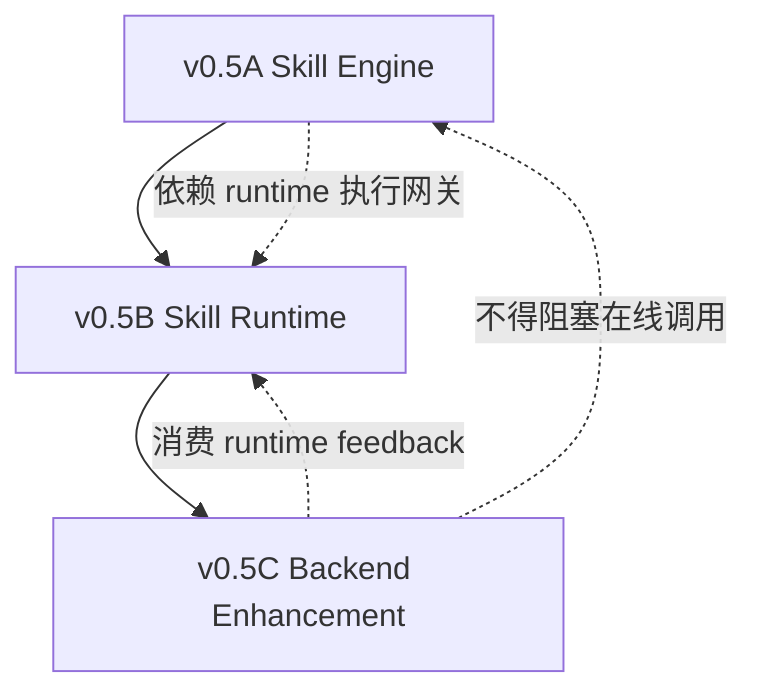
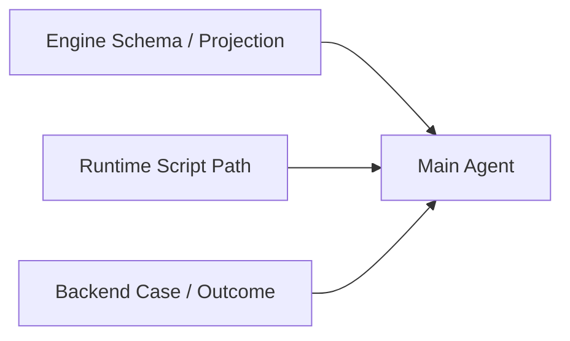
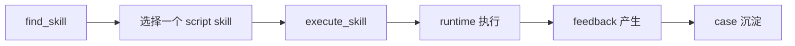

# v0.5D 总控文档：依赖关系、开发顺序、汇总与验收

## 0. 文档定位

这份文档不是新的功能设计稿。

它只做 4 件事：

1. 说明三份子文档之间的依赖关系
2. 给出推荐开发执行顺序
3. 提供阶段性汇总口径
4. 给 main agent 一份纠偏清单，防止多 subagent 并行后架构跑偏

关联文档：

- [v0.5-skill-engine-reframe.md](/Users/chenge/Desktop/skills-gp-%20research/agent-skill-platform/docs/plan/v0.5-skill-engine-reframe.md)
- [v0.5a-skill-engine-delivery-plan.md](/Users/chenge/Desktop/skills-gp-%20research/agent-skill-platform/docs/plan/v0.5a-skill-engine-delivery-plan.md)
- [v0.5b-skill-runtime-delivery-plan.md](/Users/chenge/Desktop/skills-gp-%20research/agent-skill-platform/docs/plan/v0.5b-skill-runtime-delivery-plan.md)
- [v0.5c-backend-enhancement-delivery-plan.md](/Users/chenge/Desktop/skills-gp-%20research/agent-skill-platform/docs/plan/v0.5c-backend-enhancement-delivery-plan.md)

一句话定位：

**这份文档是 main agent 的总调度、总验收、总纠偏手册。**

---

## 1. 总体原则

本轮开发必须始终遵守下面 6 条纪律：

1. 在线主链路优先，后台增强次之。
2. `find_skill` 和 `execute_skill` 是对外唯一产品面。
3. runtime 不负责选 skill，只负责把已选 skill 跑对。
4. backend enhancement 不能反向阻塞在线主链路。
5. 任何 action 执行必须显式声明，不能回退到任意脚本执行。
6. 任何 subagent 的局部最优，都不能破坏 `User Agent -> Skill Engine -> Skill Runtime` 三层边界。

---

## 2. 三块工作流的关系

### 2.1 关系图



### 2.2 解释

三块不是并列无依赖。

更准确的说：

- `Skill Engine` 是在线入口层
- `Skill Runtime` 是在线执行层
- `Backend Enhancement` 是离线演化层

因此：

- A 和 B 要先形成最小闭环
- C 建立在 B 已能稳定产出 feedback 的基础上

---

## 3. 依赖矩阵

### 3.1 模块依赖表

| 模块 | 直接依赖 | 可并行部分 | 不可越过的前置条件 |
|---|---|---|---|
| Skill Engine | registry projection、runtime gateway | projection schema、find_skill 检索可并行 | `execute_skill` 不能早于 runtime 输入输出口径冻结 |
| Skill Runtime | actions contract、install bundle、feedback envelope | script runtime、agent executor 可部分并行 | `AgentExecutor` 不能破坏现有 action contract |
| Backend Enhancement | runtime feedback、skill lab、promotion intake | case store、proposal schema、outcome store 可并行 | proposal adapter 必须建立在现有 skill lab 真实输入之上 |

### 3.2 文件级依赖

| 先做 | 后做 | 原因 |
|---|---|---|
| projection schema | `find_skill` API | API 依赖统一返回结构 |
| runtime response schema | `execute_skill` service | engine 不能猜 runtime 输出 |
| feedback 稳定化 | case analyzer | backend enhancement 不能吃不稳定反馈 |
| proposal adapter | decider 接 lab 自动化 | 现有 lab 只认完整 runtime candidate |

---

## 4. 推荐开发执行顺序

## Stage 0：冻结跨块接口

先冻结 4 个跨块接口，不要先写实现：

1. `SkillProjection`
2. `ExecuteSkillRequest / ExecuteSkillResponse`
3. `RuntimeExecutionResponse`
4. `CaseRecord / CandidateProposal / OutcomeRecord`

### 目标

让三块并行开发时有共同语言。

### main agent 输出物

- schema 草案
- 最小 JSON/YAML 示例
- 字段 owner 归属

---

## Stage 1：打通在线最小闭环

顺序：

1. A-Phase 1 Projection Schema
2. B-Phase 1 Skill Type 引入 Runtime
3. B-Phase 2 Script Runtime 收口
4. A-Phase 2 Registry Projection 输出
5. A-Phase 3 FindSkill Service
6. A-Phase 4 ExecuteSkill Service

### 目标

先跑通：

```text
find_skill -> execute_skill -> script skill runtime -> feedback
```

### 为什么先这样

因为这是最小可用产品闭环。

如果这里没跑通，后面的 agent skill 和 backend enhancement 都没有稳定地基。

---

## Stage 2：引入受限 Agent Skill

顺序：

1. B-Phase 3 AgentExecutor MVP
2. A-Phase 5 MCP / API 产品化
3. B-Phase 4 AI Decision Profile

### 目标

让在线主链路支持两类真实调用：

- `script`
- `agent`

`ai_decision` 在这一阶段以 profile 形式接入，不单独开新系统。

---

## Stage 3：接回后台增强

顺序：

1. C-Phase 1 CaseRecord
2. C-Phase 2 CandidateProposal / Decider
3. C-Phase 3 ProposalAdapter
4. C-Phase 4 Outcome Store
5. C-Phase 5 Promotion Integration

### 目标

把原先设计里的 self-evolution 收回后台，但不干扰在线执行主线。

---

## 5. 并行开发建议

### 5.1 可并行的 subagent 分组



第一轮最适合并行的是：

- Subagent 1：A 的 schema/projection
- Subagent 2：B 的 script runtime path
- Subagent 3：C 的 case/proposal schema

因为这三块 write set 冲突最小。

### 5.2 不建议并行的组合

下面两组不要同时大改：

1. `execute_skill service` 和 `runtime response shape`
2. `proposal adapter` 和 `skill_lab pipeline` 大改

原因：

- 接口还未冻结时容易互相猜字段
- 最后 main agent 整合成本会很高

---

## 6. 每阶段汇总口径

main agent 每一阶段收口时，统一按下面格式汇总：

### 6.1 Stage 汇总模板

```text
Stage:
目标:
已完成:
未完成:
接口变化:
风险:
是否允许进入下一阶段:
```

### 6.2 必须回答的 5 个问题

每一阶段结束，main agent 必须能明确回答：

1. 这一阶段新增了哪些稳定对象？
2. 哪些接口字段发生了变化？
3. 哪些能力已经可以端到端跑通？
4. 哪些能力仍然只是草案，没有进入主链路？
5. 下一阶段的开发是否建立在稳定前提上？

---

## 7. 统一开发验收

## 7.1 A 块验收：Skill Engine

必须同时满足：

1. `find_skill` 返回统一 projection，而不是原始包体
2. `execute_skill` 不要求调用方知道 package path
3. engine 只做检索和发起执行，不做 runtime runner 细节
4. registry/search 不直接承担 runtime 执行

## 7.2 B 块验收：Skill Runtime

必须同时满足：

1. runtime 能识别 `skill.type`
2. `script` skill 走显式 action contract
3. `agent` skill 只能通过受限工具面完成动作
4. 不能出现“任意脚本路径可执行”的回退设计
5. feedback shape 稳定可被 backend 消费

## 7.3 C 块验收：后台增强

必须同时满足：

1. feedback 能沉淀成 `CaseRecord`
2. patch/create 决策能沉淀成 `CandidateProposal`
3. proposal 能适配现有 skill lab
4. 结果能写回 `OutcomeRecord`
5. promotion 能回溯 case 和 proposal

## 7.4 总体验收：主线不偏离

总体验收只有一条硬标准：

```text
在线主链路不被后台增强阻塞
```

也就是：

- 没有 lab，在线也能跑
- 没有 proposal，在线也能跑
- 没有 promotion，在线也能跑

---

## 8. main agent 纠偏清单

当多个 subagent 提交结果后，main agent 必须逐条检查下面这些问题。

### 8.1 边界纠偏

1. 有没有把 User Agent 的 context 偷偷塞进 Skill Engine？
2. 有没有把 search 逻辑塞进 runtime？
3. 有没有把 runtime runner 逻辑塞进 engine？
4. 有没有把 backend enhancement 变成在线强依赖？

### 8.2 contract 纠偏

1. 是否仍然坚持显式 action contract？
2. 是否有人引入了 `run_script(path)` 这类绕过 action 的接口？
3. `SkillProjection` 和 package 元数据是否已经脱钩但仍可追溯？
4. runtime 输出字段是否被 engine 假设性扩展了？

### 8.3 执行顺序纠偏

1. 是否在 runtime 稳定前就开始写 `execute_skill` 最终 API？
2. 是否在 feedback 稳定前就开始做 case analyzer？
3. 是否在 proposal adapter 存在前就强推 proposal 直连 lab？

### 8.4 架构目标纠偏

1. 当前最先跑通的是不是 `find_skill -> execute_skill -> runtime -> feedback`？
2. agent skill 有没有被做成第二套完全独立系统？
3. `ai_decision` 有没有被过早拆成第三套 runtime？
4. backend enhancement 是否还保持离线属性？

---

## 9. main agent 最终收口动作

当三份子文档对应的开发都完成后，main agent 需要做最后四件事：

1. 做接口一致性审查
2. 做端到端最小链路验收
3. 做后台增强非阻塞性验收
4. 更新总览文档，确认新架构没有和原文档冲突

### 9.1 最小端到端验收链路



如果这条最小链路没跑通：

- 不允许宣布 v0.5 主线完成

### 9.2 完成定义

main agent 最后只能在下面 4 条都满足时收口：

1. A/B/C 三块都完成各自文档定义的最小验收
2. 在线主链路稳定
3. 后台增强可接入但不阻塞
4. 整体架构仍然保持 `Find + Execute 主链路，Enhancement 后台化`

---

## 10. 一页结论

main agent 只需要牢牢记住下面几句话：

1. 先跑通在线主链路，再接后台增强。
2. 先冻结接口，再放 subagent 并行。
3. Skill Engine 负责找和发起执行，不负责具体跑法。
4. Skill Runtime 负责跑，不负责选。
5. Backend Enhancement 负责学，不负责阻塞线上。
6. 任何时候都不能退回“隐式脚本执行”。

这份文档的唯一目的，就是保证三份子计划并行推进后，最终仍然能被 main agent 收束回同一个架构目标。*** End Patch
天天中彩票 to=functions.apply_patch code  五分彩
