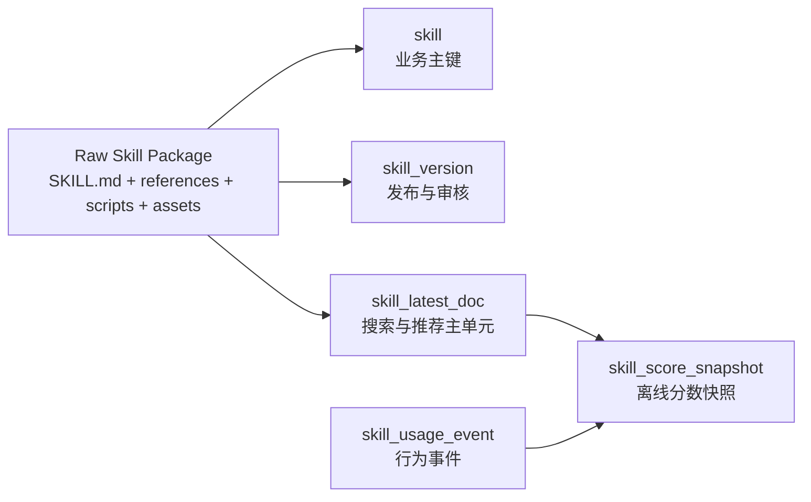
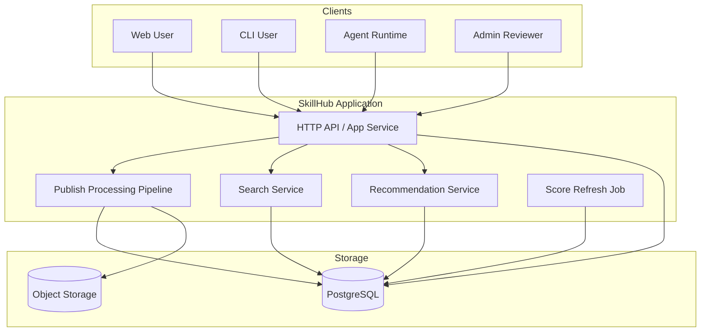
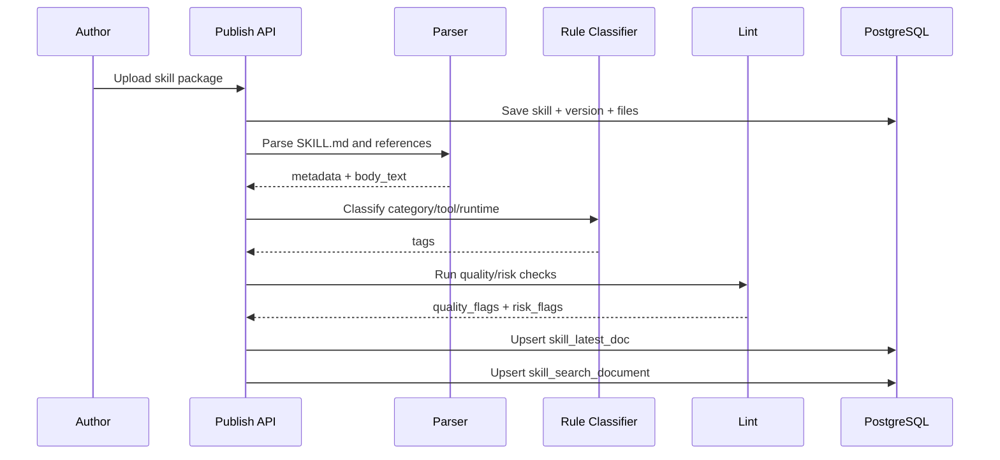
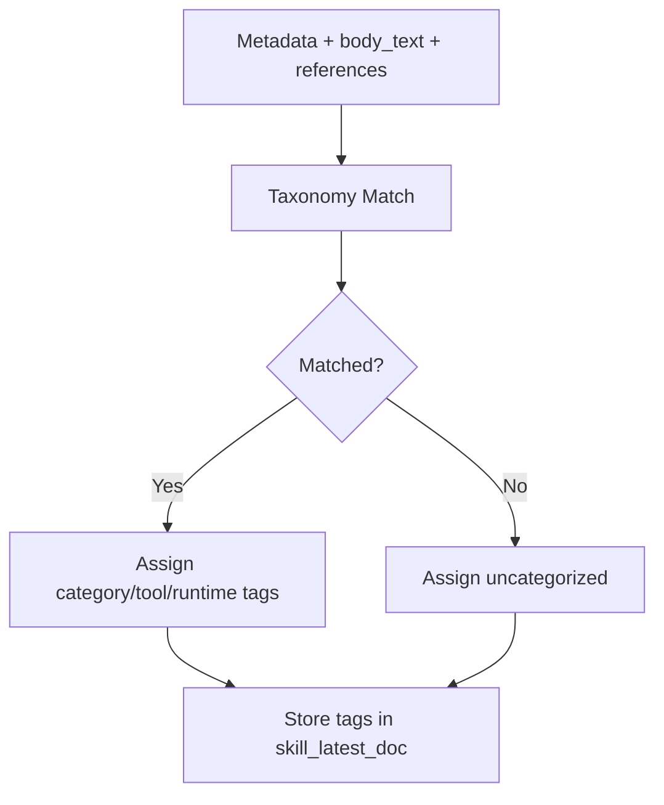
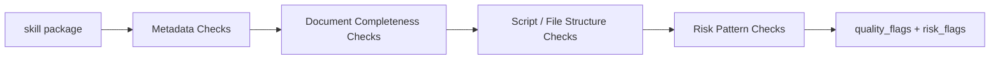
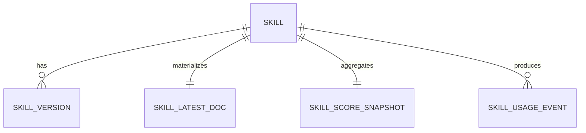

# Skill 搜索与推荐最小架构设计

> Date: 2026-04-01
> Status: Draft
> Audience: 产品、后端、搜索、平台工程
> Scope: 在不显著提高系统复杂度的前提下，为 `skillhub` 设计一套可落地的 skill 搜索与推荐架构

## 1. 文档目标

本文不讨论“理想化推荐系统”，只回答一个工程问题：

> 如何把一个 skill 包，变成一份可解析、可分类、可搜索、可推荐、可治理的标准化对象。

本文最终收敛到 5 个必须落地的能力：

1. `skill_latest_doc`
   - 把 skill 标准化成一个统一文档单元
2. taxonomy + rule-based classifier
   - 给 skill 打主题、工具、运行时标签
3. quality/risk lint
   - 判断 skill 是否结构合格、是否有明显风险
4. `skill_score_snapshot`
   - 计算稳定、可解释的排序分数
5. ACL-aware search + deterministic recommend
   - 用规则和固定公式完成搜索与推荐

## 2. 核心设计结论

### 2.1 第一性原理

从第一性原理拆解，平台只需要解决 3 件事：

1. 给定一个任务，找出可能有用的 skill
2. 在多个候选 skill 里，尽量别推错
3. 把组织内真正有效的 skill 逐步沉淀出来

### 2.2 关键约束

- 不把问题起步就做成“复杂推荐系统”
- 不依赖 agent 在线推理来完成核心流程
- 不引入图推荐、bandit、个性化、在线学习
- 搜索和推荐都必须先过 ACL
- 归类和推荐必须可解释

### 2.3 最小实现原则

- skill 先被视为“标准化文档”，不是“智能对象”
- 分类优先使用规则和 taxonomy，不优先用模型
- 推荐优先使用固定公式，不优先用学习排序
- 所有复杂度先放到离线脚本和批处理，不放到在线请求链路

## 3. 范围与非目标

### 3.1 当前范围

- 发布后解析 skill 包
- 从 `SKILL.md` 和目录结构提取字段
- 构建全文搜索文档
- 基于 taxonomy 进行静态分类
- 基于 lint 进行质量和风险检查
- 生成离线分数快照
- 提供搜索接口与推荐接口

### 3.2 明确不做

- chunk 级在线检索
- 图数据库和图推荐
- LLM 在线分类
- per-user personalization
- 自动注入 skill 到 agent 上下文
- comment 驱动推荐
- bandit / online learning

## 4. 统一对象模型

### 4.1 总体抽象

原始 skill 包不会直接进入搜索和推荐。系统会把它收敛成 4 类对象，但在线主对象只有一个：`skill_latest_doc`。



### 4.2 各对象职责

| 对象 | 粒度 | 用途 | 主要消费者 |
|------|------|------|-----------|
| `skill` | `@namespace/slug` | 业务身份、权限、社交统计 | 详情页、管理后台 |
| `skill_version` | 每个版本 | 审核、回滚、发布记录 | 发布流、治理流 |
| `skill_latest_doc` | 每个 skill 一条 | 搜索和推荐统一输入 | 搜索接口、推荐接口 |
| `skill_score_snapshot` | 每个 skill 一条 | 排序分数和质量快照 | 搜索排序、推荐排序 |
| `skill_usage_event` | 每次行为一条 | 下载、使用、成功、失败日志 | 分数计算任务 |

### 4.3 为什么在线主对象只保留 `skill_latest_doc`

因为这是最小复杂度下最稳的方案：

- 搜索只需要一条标准化文档
- 推荐也只需要在这条文档基础上做过滤和打分
- 不需要把正文拆成复杂的在线语义块
- 不需要引入额外索引结构

## 5. 系统总体架构

### 5.1 逻辑架构图



### 5.2 组件职责

| 组件 | 职责 | 是否在线 |
|------|------|---------|
| Publish Processing Pipeline | 解析、分类、lint、构建搜索文档 | 否，发布触发 |
| Search Service | ACL 过滤、全文搜索、结构化过滤、排序 | 是 |
| Recommendation Service | 任务解析、候选过滤、固定公式排序 | 是 |
| Score Refresh Job | 汇总事件、计算分数快照 | 否，定时/异步 |

## 6. 发布后处理流水线

### 6.1 发布流水线总图


### 6.2 各阶段输入输出

| 阶段 | 输入 | 输出 | 实现方式 |
|------|------|------|---------|
| Persist Files | skill 包 | `skill` / `skill_version` / 文件对象 | 后端写库 + 对象存储 |
| Parse Metadata | `SKILL.md` | `display_name`、`summary`、`body_text`、基础字段 | 解析脚本 |
| Rule-based Classification | 文本 + 文件结构 | `category_tags`、`tool_tags`、`runtime_tags` | taxonomy + 正则 + 词典 |
| Quality / Risk Lint | 文本 + 文件结构 | `quality_flags`、`risk_flags` | lint 脚本 |
| Build skill_latest_doc | 前面全部结果 | 标准化文档 | ETL 脚本 |
| Upsert Search Document | `skill_latest_doc` | `skill_search_document` / 查询视图 | 数据库 upsert |

### 6.3 发布处理时序图



## 7. `skill_latest_doc` 设计

### 7.1 字段结构

建议把 `skill_latest_doc` 作为读优化表或物化视图来建模。

| 字段组 | 字段 | 说明 |
|------|------|------|
| Identity | `skill_id`, `namespace`, `slug`, `display_name`, `summary`, `visibility` | 业务身份和 ACL 基础 |
| Text | `body_text`, `keywords`, `examples_text`, `references_text` | 搜索文本面 |
| Tags | `category_tags`, `tool_tags`, `runtime_tags` | 结构化过滤面 |
| Governance | `reviewed`, `official`, `recommended`, `hidden` | 信任与治理信号 |
| Stats | `download_count`, `star_count`, `rating_avg`, `rating_count`, `success_rate`, `updated_at` | 排序基础 |

### 7.2 示例对象

```json
{
  "skillId": 101,
  "namespace": "@team-ai",
  "slug": "github-pr-review",
  "displayName": "GitHub PR Review",
  "summary": "Review GitHub PRs with checklist and CI triage steps",
  "bodyText": "...",
  "keywords": ["github", "pr", "review", "ci"],
  "categoryTags": ["code-review"],
  "toolTags": ["git", "github"],
  "runtimeTags": ["claude-code"],
  "reviewed": true,
  "official": false,
  "recommended": true,
  "hidden": false,
  "downloadCount": 124,
  "starCount": 36,
  "ratingAvg": 4.7,
  "ratingCount": 19,
  "successRate": 0.81,
  "updatedAt": "2026-04-01T08:00:00Z"
}
```

## 8. 分类架构

### 8.1 分类目标

分类不是做开放世界理解，而是为了支持：

- 搜索过滤
- 推荐候选缩小
- 页面上的分类展示
- 治理上的风险隔离

### 8.2 分类维度

| 维度 | 示例 | 作用 |
|------|------|------|
| Category | `code-review`, `database`, `research` | 搜索和推荐主分类 |
| Tool | `git`, `github`, `browser`, `postgres` | 任务适配 |
| Runtime | `claude-code`, `openclaw` | 环境适配 |
| Trust | `official`, `recommended`, `reviewed` | 排序和推荐保护 |

### 8.3 分类流程图



### 8.4 taxonomy 示例

```yaml
categories:
  code-review:
    keywords: [review, pull request, pr, diff]
  database:
    keywords: [sql, postgres, migration, query]
  browser-automation:
    keywords: [browser, playwright, screenshot]

tools:
  github:
    keywords: [github, pull request, repository]
  git:
    keywords: [git, commit, branch, diff]
  postgres:
    keywords: [postgres, sql, migration]

runtimes:
  claude-code:
    keywords: [claude code, claude-code]
  openclaw:
    keywords: [openclaw]
```

### 8.5 分类实现原则

- 先规则，后增强
- 分类器输出只作为建议，不作为唯一真相
- 管理员标签优先级高于自动分类
- 未命中时统一打 `uncategorized`

## 9. 质量与风险检查架构

### 9.1 质量检查目标

质量检查不评估“聪明程度”，只评估是否值得进入推荐候选。

### 9.2 规则项

| 类型 | 规则示例 | 输出 |
|------|---------|------|
| Metadata 完整性 | 缺少 `name` / `description` | `quality_flag` |
| 文档完整性 | 缺少 examples / references | `quality_flag` |
| 结构复杂度 | 脚本数量过多、文件数过多 | `quality_flag` |
| 风险规则 | 危险命令、疑似越权脚本 | `risk_flag` |
| 环境声明 | 缺少 runtime/tool 声明 | `quality_flag` |

### 9.3 质量检查流程图



### 9.4 最小评分规则

不做复杂模型，先使用线性规则：

```text
quality_score =
100
- 20 * missing_required_metadata
- 10 * missing_examples
- 10 * missing_references
- 15 * runtime_not_declared
- 30 * risky_script_detected
```

最后裁剪到 `0-100`。

## 10. 搜索架构

### 10.1 搜索目标

搜索的目标是：

- 不漏掉可能有用的 skill
- 保证 ACL 正确
- 排序可解释

### 10.2 搜索流程图


### 10.3 搜索请求输入

| 参数 | 说明 |
|------|------|
| `q` | 搜索关键词 |
| `namespace` | 可选，命名空间过滤 |
| `category` | 可选，分类过滤 |
| `tool` | 可选，工具过滤 |
| `runtime` | 可选，运行时过滤 |
| `sortBy` | `relevance` / `downloads` / `rating` / `newest` |

### 10.4 搜索排序公式

最小实现使用固定加权公式：

```text
search_score =
0.60 * lexical_match +
0.15 * category_match +
0.10 * trust_score +
0.10 * quality_score +
0.05 * freshness_score
```

各项来源：

| 分项 | 来源 |
|------|------|
| `lexical_match` | PostgreSQL `ts_rank` |
| `category_match` | query 与 category/tool/runtime 标签匹配 |
| `trust_score` | `official`, `recommended`, `reviewed` |
| `quality_score` | `skill_score_snapshot` |
| `freshness_score` | `updated_at` 衰减 |

### 10.5 搜索结果解释

返回结果时建议附带 `reasons`：

```json
{
  "reasons": [
    "命中关键词 review",
    "分类匹配 code-review",
    "适用于 claude-code",
    "已审核"
  ]
}
```

这一步很重要，因为它让搜索和推荐都可解释。

## 11. 推荐架构

### 11.1 推荐目标

推荐不是“猜用户喜欢什么”，而是“给当前任务找最合适的 skill”。

### 11.2 推荐输入

最小输入只保留 4 个：

| 输入 | 说明 |
|------|------|
| `task_text` | 当前任务文本 |
| `runtime` | 当前运行时 |
| `available_tools` | 当前可用工具列表 |
| `acl_scope` | 当前用户可访问范围 |

### 11.3 推荐流程图


### 11.4 推荐实现步骤

1. ACL 过滤
2. 从 `task_text` 中提取 category/tool/runtime 关键词
3. 过滤掉 runtime 不兼容、工具不兼容的 skill
4. 计算固定分数
5. 返回 Top 3

### 11.5 推荐排序公式

```text
reco_score =
0.50 * task_match +
0.20 * tool_match +
0.15 * runtime_match +
0.10 * trust_score +
0.05 * quality_score
```

各项解释：

| 分项 | 来源 |
|------|------|
| `task_match` | `task_text` 与 category/tool 规则命中 |
| `tool_match` | skill 的 `tool_tags` 与可用工具匹配 |
| `runtime_match` | skill 的 `runtime_tags` 与当前 runtime 匹配 |
| `trust_score` | `official`, `recommended`, `reviewed` |
| `quality_score` | `skill_score_snapshot` |

### 11.6 推荐返回示例

```json
{
  "items": [
    {
      "skill": "@team-ai/github-pr-review",
      "score": 0.87,
      "reasons": [
        "任务匹配 code-review",
        "工具匹配 git/github",
        "运行时匹配 claude-code",
        "已审核"
      ]
    }
  ]
}
```

## 12. 分数快照与批处理架构

### 12.1 为什么要有 `skill_score_snapshot`

因为下载量、评分、成功率、更新时间都不适合在在线请求中逐次聚合。

所以应使用一个独立快照表，统一存放：

- `quality_score`
- `trust_score`
- `freshness_score`
- `success_rate`
- `rating_bayes`
- `download_count`

### 12.2 批处理流程图


### 12.3 快照计算项

| 指标 | 计算方式 |
|------|---------|
| `download_count` | 累加 |
| `star_count` | 累加 |
| `rating_bayes` | 贝叶斯平滑评分 |
| `success_rate` | 最近 N 天成功数 / 使用数 |
| `freshness_score` | 基于 `updated_at` 的衰减函数 |
| `trust_score` | `official` / `recommended` / `reviewed` 映射 |

### 12.4 事件与快照关系图



## 13. 数据表建议

### 13.1 最小新增表

| 表 | 必要性 | 作用 |
|------|------|------|
| `skill_latest_doc` | 必须 | 搜索和推荐统一输入 |
| `skill_score_snapshot` | 必须 | 排序快照 |
| `skill_usage_event` | 建议 | 统计事件源 |
| `taxonomy_rule` | 建议 | 规则分类配置 |

### 13.2 `skill_latest_doc` 建表示意

```sql
CREATE TABLE skill_latest_doc (
    skill_id BIGINT PRIMARY KEY,
    namespace_slug VARCHAR(64) NOT NULL,
    skill_slug VARCHAR(128) NOT NULL,
    display_name VARCHAR(256) NOT NULL,
    summary VARCHAR(512),
    visibility VARCHAR(32) NOT NULL,
    body_text TEXT,
    keywords TEXT,
    examples_text TEXT,
    references_text TEXT,
    category_tags JSONB NOT NULL DEFAULT '[]',
    tool_tags JSONB NOT NULL DEFAULT '[]',
    runtime_tags JSONB NOT NULL DEFAULT '[]',
    reviewed BOOLEAN NOT NULL DEFAULT FALSE,
    official BOOLEAN NOT NULL DEFAULT FALSE,
    recommended BOOLEAN NOT NULL DEFAULT FALSE,
    hidden BOOLEAN NOT NULL DEFAULT FALSE,
    updated_at TIMESTAMPTZ NOT NULL
);
```

### 13.3 `skill_score_snapshot` 建表示意

```sql
CREATE TABLE skill_score_snapshot (
    skill_id BIGINT PRIMARY KEY,
    quality_score NUMERIC(5,2) NOT NULL,
    trust_score NUMERIC(5,2) NOT NULL,
    freshness_score NUMERIC(5,2) NOT NULL,
    success_rate NUMERIC(5,4),
    rating_bayes NUMERIC(5,2),
    download_count BIGINT NOT NULL DEFAULT 0,
    updated_at TIMESTAMPTZ NOT NULL
);
```

## 14. API 设计

### 14.1 搜索接口

```http
GET /api/v1/skills/search?q=review&category=code-review&runtime=claude-code
```

返回：

- 基础 skill 信息
- `score`
- `reasons`

### 14.2 推荐接口

```http
POST /api/v1/skills/recommend
Content-Type: application/json

{
  "taskText": "review a GitHub PR and check CI failures",
  "runtime": "claude-code",
  "availableTools": ["git", "github"]
}
```

返回：

- Top 3 候选
- 每条候选的 `score`
- 每条候选的 `reasons`

## 15. 在线与离线责任边界

### 15.1 在线链路只做什么

- 读取 ACL
- 解析请求
- 结构化过滤
- 调用全文搜索
- 读取快照分数
- 计算最终排序

### 15.2 离线链路做什么

- 解析 skill 包
- taxonomy 分类
- lint 检查
- 统计事件汇总
- 分数快照计算

### 15.3 边界原则

- 在线不跑重解析
- 在线不跑复杂聚合
- 在线不做模型训练
- 在线不做复杂 agent reasoning

## 16. 实施计划

### Phase 1: 标准化与搜索

交付：

- `skill_latest_doc`
- taxonomy 规则分类
- quality/risk lint
- 基于 PostgreSQL 的搜索

### Phase 2: 快照评分

交付：

- `skill_usage_event`
- `skill_score_snapshot`
- 搜索结果中的分数与解释

### Phase 3: 最小推荐

交付：

- `POST /skills/recommend`
- 基于 task/runtime/tool 的 Top 3 推荐

## 17. 最终结论

这套方案的核心不是“做一个推荐系统”，而是：

1. 把每个 skill 变成一份标准化文档
2. 把这份文档稳定地打上分类、工具、运行时、风险标签
3. 用一个简单、可解释的固定公式做搜索和推荐排序

如果只保留一句话，那就是：

> 先把 skill 做成可计算对象，再谈搜索；先把搜索做成确定性系统，再谈推荐。

## 18. 关联文档

- `skillhub/docs/00-product-direction.md`
- `skillhub/docs/04-search-architecture.md`
- `skillhub/docs/2026-03-20-skill-label-system-design.md`
